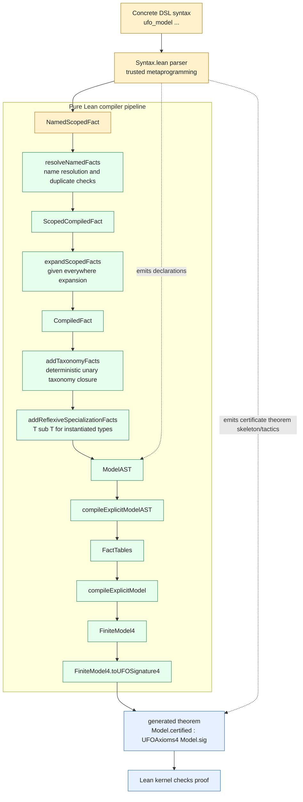

# Certified DSL Pipeline Status

This document is the detailed status note for the finite UFO DSL backend. It is
intended to be more exhaustive than the top-level README and to make the current
trusted/verified boundary explicit.

## Contents

- [Pipeline Snapshot](#pipeline-snapshot)
- [Trust Boundary Diagram](#trust-boundary-diagram)
- [What Is Formally Guaranteed](#what-is-formally-guaranteed)
- [What Is Still Trusted](#what-is-still-trusted)
- [Generated Declarations](#generated-declarations)
- [Diagnostics Widget](#diagnostics-widget)
- [Surface Syntax](#surface-syntax)
- [Semantic Derivations](#semantic-derivations)
- [Current Limitations](#current-limitations)
- [File Roles](#file-roles)
- [How To Check The DSL](#how-to-check-the-dsl)

## Pipeline Snapshot

The current `ufo_model ... certify` command follows this pipeline:

```text
trusted Lean command parser
  -> NamedScopedFact
  -> resolveNamedFacts
  -> ScopedCompiledFact
  -> expandScopedFacts
  -> CompiledFact
  -> addTaxonomyFacts
  -> addReflexiveSpecializationFacts
  -> ModelAST
  -> compileExplicitModelAST
  -> FactTables
  -> compileExplicitModel
  -> FiniteModel4
  -> FiniteModel4.toUFOSignature4
  -> UFOAxioms4 certificate
```

The main semantic pipeline after parsing lives in `Compiler.lean` as ordinary
Lean functions. The generic facts documenting that pipeline live in
`Guarantees.lean`. The current command frontend runs these pure functions while
elaborating the command, then emits an already-expanded `ModelAST` declaration.
Thus the function definitions and generic theorems are verified Lean artifacts,
while the concrete emitted AST value remains part of the metaprogramming
boundary.

The frontend also saves a UFO diagnostics widget for each model command. The
widget is user-facing, but its certificate-status labels are driven by the same
generated proof checks that Lean elaborates.

Pipeline stages:

- `trusted Lean command parser`: the `ufo_model ... where ...` syntax is parsed
  by Lean metaprogramming in `Syntax.lean`. This is the concrete frontend
  boundary.
- `NamedScopedFact`: parser output that still uses user-facing names such as
  `actual`, `I`, and `K`, and records whether a fact is scoped to one world or
  `everywhere`.
- `resolveNamedFacts`: pure name-resolution pass. It checks duplicate world and
  thing names, rejects unknown names, and replaces user names with numeric
  indices.
- `ScopedCompiledFact`: resolved facts whose worlds/things are numeric, but
  whose scope may still be either one world or `everywhere`.
- `expandScopedFacts`: pure scope-expansion pass. Facts scoped to one world stay
  single facts; facts scoped to `everywhere` are copied to every declared world.
- `CompiledFact`: ordinary world-indexed facts. At this point there are no
  names and no `everywhere` scope left.
- `addTaxonomyFacts`: pure deterministic taxonomy expansion. For example,
  `ObjectKind` contributes the encoded ancestor classifications such as `Kind`,
  `Sortal`, and the relevant type-taxonomy facts.
- `addReflexiveSpecializationFacts`: pure closure pass that inserts `T ⊑ T` for
  each type target detected from instantiation facts, at each declared world.
- `ModelAST`: the expanded finite model syntax tree emitted as a Lean
  declaration. It records world count, thing count, and the final compiled fact
  list.
- `compileExplicitModelAST`: pure fold from the expanded `ModelAST` into
  collected primitive facts and derived-assertion propositions.
- `FactTables`: the finite compiled data used by the backend. This is the last
  compact compiler representation before constructing the semantic model.
- `compileExplicitModel`: pure construction of a `FiniteModel4` from the
  expanded AST, using positivity proofs for the declared world and thing counts.
- `FiniteModel4`: the finite backend representation of worlds, things, and
  primitive finite facts.
- `FiniteModel4.toUFOSignature4`: semantic bridge from the finite backend to the
  Prop-valued `UFOSignature4` used by the core UFO axioms. This is where selected
  derived predicates receive their computed semantics.
- `UFOAxioms4 certificate`: generated Lean theorem proving that the compiled
  signature satisfies the encoded UFO axiom package.

## Trust Boundary Diagram



Legend:

- Yellow: trusted parser/declaration-emission boundary, including the concrete
  parsed fact value produced by the command elaborator.
- Green: ordinary Lean functions with generic theorem-backed guarantees.
- Blue: generated Lean theorem checked by the Lean kernel.

## What Is Formally Guaranteed

The guarantees below are generic theorems.

### Name Resolution

`Guarantees.lean` proves:

- `resolveThing_of_nameIndex_eq_some`
- `resolveThing_of_nameIndex_eq_none`
- `resolveWorld_of_nameIndex_eq_some`
- `resolveWorld_of_nameIndex_eq_none`
- `resolveScope_everywhere`
- `resolveScope_at_of_resolveWorld_eq_ok`
- `resolveNamedFact_unary_of_resolved`
- `resolveNamedFact_binary_of_resolved`
- `resolveNamedFacts_of_checks_ok`

These show that named thing/world lookup is governed by the pure `nameIndex?`
function, that absent names produce explicit errors, and that batch resolution
delegates to the pure single-fact resolver after duplicate-name checks.

### Scope Expansion

`given everywhere` is not expanded by an ad-hoc loop in the syntax frontend.
The parser records it as `NamedFactScope.everywhere`; after name resolution it
is expanded by `expandScopedFacts`.

`Guarantees.lean` proves:

- `unary_at_expands_to_singleton`
- `binary_at_expands_to_singleton`
- `derived_at_expands_to_singleton`
- `scoped_expansion_pipeline`

These describe how scoped facts become ordinary world-indexed facts.

### Taxonomy Expansion

The compiler has two paths:

- `compileFact`, which inserts unary taxonomy ancestors directly.
- the generated-model path, which first makes taxonomy facts explicit with
  `addTaxonomyFacts`, then uses `compileExplicitFact`.

`Guarantees.lean` proves:

- `unary_compiles_with_taxonomy`
- `explicit_unary_compiles_to_table`
- `taxonomy_expansion_pipeline`

These are pipeline guarantees. They expose where taxonomy expansion happens.
They do not yet prove a full graph-reachability theorem saying that the added
facts are exactly all and only taxonomy ancestors reachable through
`unaryTaxonomyParents`.

The current taxonomy expansion is intended to be conservative with respect to
the encoded UFO hierarchy: it adds only positive consequences of the axioms and
derived theorems, and it avoids reverse or choice-producing inferences. For
example, `Endurant` expands to `ConcreteIndividual`, but `ConcreteIndividual`
does not expand back to either `Endurant` or `Perdurant`, because that would
require choosing one branch of `ConcreteIndividual ↔ Endurant ∨ Perdurant`.

Current taxonomy:

| Expansion group | Added parent facts | UFO source |
| --- | --- | --- |
| `Object`, `Collective`, `Quantity` | `Substantial` | Section 3.3, `a36`: `Object ∨ Collective ∨ Quantity ↔ Substantial` |
| `Relator`, `IntrinsicMoment` | `Moment` | Section 3.3, `a40`: `Relator ∨ IntrinsicMoment ↔ Moment` |
| `Mode` | `IntrinsicMoment` | Section 3.3, `a42`: `Mode ∨ Quality ↔ IntrinsicMoment` |
| `Substantial`, `Moment` | `Endurant` | Section 3.3, `a34`: `Substantial ∨ Moment ↔ Endurant` |
| `Endurant`, `Perdurant` | `ConcreteIndividual` | Section 3.1, `a11`, `a12`, and `a14` |
| `Quale`, `Set` | `AbstractIndividual` | Section 3.12, `a83` and `a84` |
| `Rigid`, `AntiRigid`, `SemiRigid` | `EndurantType` | Section 3.2, `a18`, `a19`, `a20` |
| `Kind`, `SubKind` | `Rigid`, `Sortal` | Section 3.2, `a26`: `Kind ∨ SubKind ↔ Rigid ∧ Sortal` |
| `Phase`, `Role` | `AntiRigid`, `Sortal` | Section 3.2, `a28`: `Phase ∨ Role ↔ AntiRigid ∧ Sortal` |
| `SemiRigidSortal` | `SemiRigid`, `Sortal` | Section 3.2, `a29` |
| `Category` | `Rigid`, `NonSortal` | Section 3.2, `a30` |
| `Mixin` | `SemiRigid`, `NonSortal` | Section 3.2, `a31` |
| `PhaseMixin`, `RoleMixin` | `AntiRigid`, `NonSortal` | Section 3.2, `a32` |
| `Sortal`, `NonSortal` | `EndurantType` | Section 3.2, `a23`, `a24` |
| `ObjectKind`, `CollectiveKind`, `QuantityKind`, `RelatorKind`, `ModeKind`, `QualityKind` | their corresponding specific type plus `Kind` | Section 3.4, `a45` |
| `ObjectType`, `CollectiveType`, `QuantityType` | `SubstantialType` | Section 3.4, `a44` plus the corresponding individual taxonomy |
| `RelatorType`, `IntrinsicMomentType` | `MomentType` | Section 3.4, `a44` plus the corresponding individual taxonomy |
| `ModeType`, `QualityType` | `IntrinsicMomentType`, then `MomentType` | Section 3.4, `a44` plus the corresponding individual taxonomy |
| `SubstantialType`, `MomentType` | `EndurantType` | Section 3.4, `a44` plus the corresponding individual taxonomy |

The strongest currently formalized fact is still the pipeline theorem above:
`addTaxonomyFacts` applies exactly this encoded parent map. We do not yet have a
separate theorem proving, edge by edge, that each parent implication follows
from the UFO axioms. The practical backstop is the generated certificate:
if the expanded model violates `UFOAxioms4`, `certify` fails.

### Reflexive Specialization Expansion

For each type target found in instantiation facts, the compiler inserts
reflexive specialization facts at each declared world. This supports the
encoded requirement that types specialize themselves.

`Guarantees.lean` proves:

- `reflexive_specialization_expansion_pipeline`

This exposes the expansion policy. It does not yet prove an extensional theorem
such as "for every `x :: T`, `T sub T` appears at every world, and only such
facts are introduced by this closure."

### Explicit Fact Compilation

Generated models compile from an already-expanded `ModelAST`.

`Guarantees.lean` proves:

- `explicit_unary_compiles_to_table`
- `explicit_binary_compiles_to_table`
- `explicit_derived_compiles_to_assertion`
- `explicit_compilation_pipeline`

Thus, in the generated path, expanded unary/binary facts become direct table
insertions, and derived facts become generated propositions checked by Lean.

### Finite Model Construction

`FactTables.toFiniteModel4` is a pure constructor for the finite semantic
model.

`Guarantees.lean` proves:

- `explicit_model_pipeline`
- `toFiniteModel4_inst_eq`
- `toFiniteModel4_sub_eq`
- `toFiniteModel4_part_eq`
- `toFiniteModel4_setExtension_iff_memberOf`
- `toFiniteModel4_tupleProjection_eq`
- `toFiniteModel4_distance_eq`
- `toFiniteModel4_distanceZero_eq`
- `toFiniteModel4_distanceSum_eq`
- `toFiniteModel4_distanceGreaterEq_eq`

These show that generated finite models are built by ordinary compilation from
explicit AST facts to finite tables and then to `FiniteModel4`, with key fields
connected to the intended table lookups. Set extension is backed by the
compiled `MemberOf` table, tuple projection is backed by explicit
`TupleProjection` facts with identity default, and distance predicates are read
from their finite primitive tables.

### Semantic Bridge

`FiniteModel.lean` compiles `FiniteModel4` into the trusted Prop-valued
`UFOSignature4`.

`Guarantees.lean` proves:

- `compiled_frame_universal`
- `compiled_frame_refl`
- `compiled_frame_symm`
- `compiled_frame_trans`
- `compiled_signature_frame_universal`
- `compiled_type_iff`
- `compiled_individual_iff`
- `compiled_inst_iff`
- `compiled_sub_iff`
- `compiled_part_iff`
- `compiled_memberOf_iff_setExtension`
- `compiled_distance_iff`
- `compiled_distanceZero_iff`
- `compiled_distanceSum_iff`
- `compiled_distanceGreaterEq_iff`
- `compiled_constitution_iff`

These connect the finite representation to the semantic signature used by the
UFO axioms.

### Certification Meaning

The DSL does not introduce a new, weaker notion of certification.

`Guarantees.lean` proves:

- `certified_iff_ufoAxioms4`
- `certified_sound`
- `certified_of_ufoAxioms4`

The key theorem is:

```lean
FiniteModel4.Certified M ↔ UFOAxioms4 M.toUFOSignature4
```

So every generated:

```lean
Model.certified : UFOAxioms4 Model.sig
```

is an ordinary Lean theorem about the original UFO axiom package.

## What Is Still Trusted

The following pieces are still part of the trusted frontend boundary:

- concrete Lean command parsing for `ufo_model ... where ...`;
- conversion of parsed Lean identifiers to string names;
- construction/emission of the generated `ast`, `tables`, `data`, `sig`, and
  certificate theorem declarations;
- the tactic script used to search for each generated proof.

The tactic script is trusted only as a proof-search program, not as proof
evidence. The Lean kernel still checks the resulting theorem. If the tactic
constructs an invalid proof, elaboration fails.

## Generated Declarations

A certified model command emits declarations of this shape:

```lean
Model.ast       : ModelAST
Model.tables    : FactTables
Model.data      : FiniteModel4
Model.sig       : UFOSignature4

Model.assertedDerivedFacts : ...

Model.certified_ax1 : ax_a1 Model.sig.toUFOSignature3_1
Model.certified_ax2 : ax_a2 Model.sig.toUFOSignature3_1
-- ...
Model.certified_ax108 : ax_a108 Model.sig

Model.certified : UFOAxioms4 Model.sig
Model.certifiedModel : FiniteModel4.Certified Model.data
```

The generated AST is already expanded: `given everywhere`, unary taxonomy
closure, and reflexive specialization closure have been materialized before
`compileExplicitModelAST` is used. The generated Lean file does not currently
emit the named pre-resolution AST and replay `resolveNamedFacts` inside the
object language; that remains a possible future tightening of the audit trail.

## Diagnostics Widget

The VS Code widget attached to a `ufo_model ... certify` command reports:

- the model name;
- declared worlds and things with their generated finite indices;
- the original input facts in user-facing names;
- the expanded finite facts compiled by the DSL frontend;
- generated certificate fields with `success`, `failed`, or `unchecked` status;
- failure analysis when a derived assertion or generated certificate fails.

Certificate checks are probed in order. If a proof fails, the widget is saved
once with all completed fields marked `success`, the first failing field marked
`failed`, and all later fields marked `unchecked`.

For failed certificate fields, the frontend also runs a separate negative
probe. If Lean proves the negation of the generated axiom for the finite model,
the widget reports a confirmed semantic counterexample and tries to reconstruct
the witness in DSL-level terms. If both the certificate proof and the negative
probe fail, the widget reports proof-search/probe exhaustion instead of
claiming a semantic counterexample. Some large or context-sensitive fields are
checked by elaborating the generated theorem command directly rather than by a
standalone term preflight; this avoids treating probe incompleteness as a model
failure. The explicit command-probe set currently includes `ax1`-`ax6`, `ax44`,
and `ax68`: the first group expands finite definitions over all things/worlds,
`ax44` expands the endurant-type taxonomy mirror, and `ax68` uses a custom
ultimate-bearer proof shape.

Counterexample cards use condition-specific headings:

- `Required but missing`: one missing DSL-level fact is required.
- `Need one of`: at least one listed alternative must hold.
- `Required together`: all listed facts/conditions must hold together.
- `Missing witness requirements`: an existential/witness obligation is missing.
- `Forbidden condition`: a fact or combination holds but should be absent.

`ax68` is intentionally conservative in test reporting. The diagnostics closure
checker can detect finite table situations such as a moment with no reachable
non-moment ultimate bearer.  However, unless Lean also proves the negation of
the generated ax68 proposition, the result is reported as proof-search/probe
exhaustion plus closure evidence, not as a confirmed semantic counterexample.
Consequently ax68 currently has a direct positive fixture but no managed direct
negative fixture.

The widget uses Lean's native user-widget/infoview mechanism (`Lean.Widget` and
`@[widget_module]`). It is a presentation layer over elaboration results, not
proof evidence. The certification result is still determined by Lean elaborating
and checking the generated proof terms. Widget API compatibility may track the
Lean version.

`Guarantees.lean` proves the pure status-rendering contract used by the widget:
`success` corresponds exactly to membership in the completed field list, and
among non-completed fields the recorded first failure is exactly the field shown
as `failed`.

## Surface Syntax

The canonical facts are:

```lean
P(x)        -- unary UFO classification predicate
x :: T      -- UFO instantiation
T1 ⊑ T2     -- specialization
R(x, y)     -- binary relation fact
R(x, y, z)  -- selected ternary primitive or derived relation fact
```

Examples:

```lean
given actual:
  Object(Mark)
  Mark :: Person
  ObjectKind(Person)
  Employee ⊑ Person
```

Facts that hold in every declared world use the reserved pseudo-world:

```lean
given everywhere:
  ObjectKind(Person)
```

Selected derived relations can be asserted explicitly:

```lean
IsDisjointWith(Person, Organization)
IsPartitionedInto(Person, Employee, NonEmployee)
```

Derived assertions are checked in `Model.assertedDerivedFacts`; they do not
override the semantic definitions computed by the compiler.

Section 3.12 surface syntax is available for finite set and distance data:

```lean
MemberOf(tuple, domain)
TupleProjection(tuple, 0, component)
Distance(q1, q2, r)
DistanceSum(r0, r1, s)
DistanceZero(r)
DistanceGreaterEq(s, r)
```

`MemberOf` is a primitive table fact whose compiled semantics populates set
extension. `TupleProjection` facts populate finite tuple-projection lookup, with
identity default when no projection fact is present. `Distance`, `DistanceSum`,
`DistanceZero`, and `DistanceGreaterEq` are primitive finite distance tables.

The accepted directives are currently:

```lean
derive_relations
certify
```

## Semantic Derivations

Some predicates are not arbitrary user-controlled tables in the compiled
signature. The compiler gives them their semantic definitions from lower-level
finite tables, then Lean checks the original axioms.

Current derived semantics include:

- `Type`: derived from possible instantiation;
- `Individual`: derived from absence of instantiation;
- selected definition-like Section 3.1, 3.9, and 3.12 predicates:
  - `ProperSub`
  - `UltimateBearerOf`
  - `Quality`
  - `NonEmptySet`
  - `QualityStructure`
  - `SimpleQuality`
  - `ComplexQuality`
  - `SimpleQualityType`
  - `ComplexQualityType`
  - `SubsetOf`
  - `ProperSubsetOf`
- Section 3.6:
  - `GenericFunctionalDependence`
  - `IndividualFunctionalDependence`
  - `ComponentOf`
- Section 3.7:
  - `GenericConstitutionalDependence`
  - `Constitution`
- Section 3.8:
  - `ExistentialDependence`
  - `ExistentialIndependence`
- Selected Section 3.10 predicates:
  - `ExternallyDependent`
  - `ExternallyDependentMode`
  - `QuaIndividual`
- Section 4:
  - `IsDisjointWith`
  - `IsCompletelyCoveredBy`
  - `IsPartitionedInto`
  - `Categorizes`

`Part`, `Overlap`, and `ProperPart` are finite user tables. `Part` and
`Overlap` include identity by default in generated models. Certification is
responsible for proving that the resulting mereological tables satisfy the
Section 3.5 axioms.

## Current Limitations

The finite DSL does not yet surface every field of `UFOSignature4`.

Missing or limited surface support includes:

- custom accessibility relations; generated models use the default universal
  S5 frame;
- full product-subset authoring support for richer quality-structure examples;
  the primitive pieces (`MemberOf`, `TupleProjection`, and distance facts) are
  available, but there is not yet higher-level syntax for product families;
- primitive higher-arity tables for `IndividualFunctionalDependence`,
  `ComponentOf`, and `Constitution`; users can assert these as derived facts,
  but the semantic compiler computes them from lower-level relations;
- level-aware higher-order type declarations needed for the full
  concept-evolution pattern in UFO Section 4.5.

The diagnostics widget now reports named worlds, named things, input facts,
expanded finite facts, certificate status, and DSL-level failure analysis for
many axiom and derived-assertion failures.  Some witness extractors remain
intentionally conservative, especially where the axiom uses product families or
higher-arity relations whose useful source-level presentation needs more DSL
structure.

The DSL has a flat `things` namespace and a single flat `::`
instantiation table. This is enough for first-order finite witnesses and for
checking derived Section 4 relations such as disjointness, coverage,
partitioning, and simple categorization assertions. It is not enough for a
faithful certified version of the paper's concept-evolution case, where
first-order types instantiate higher-order types while also specializing stable
base types.

## File Roles

- `Certification.lean`: finite quantifier reflection and decidability bridges
  for UFO axiom packages.
- `Compiler.lean`: pure DSL pipeline after parsing, including name resolution,
  scope expansion, taxonomy expansion, reflexive specialization expansion,
  table compilation, and finite-model construction.
- `FiniteModel.lean`: finite semantic representation and compilation to
  `UFOSignature4`.
- `Syntax.lean`: thin command frontend for `ufo_model ... certify`; parses
  concrete Lean syntax, emits declarations, invokes the pure compiler, and saves
  the diagnostics widget.
- `Guarantees.lean`: generic theorem-backed guarantees for the DSL pipeline and
  semantic bridge, including the pure diagnostic-status classifier.
- `Examples.lean`: imports the passing concrete DSL examples.
- `ConcreteExamples/*.lean`: passing certified finite DSL models, negative
  diagnostic examples whose filenames start with `Failed`, and
  `ConceptEvolution.lean`, which documents the current higher-order limitation.
- `LeanUfoTest.lean`: executable `lake test` driver. It keeps the default suite
  fast, runs expected-failure checks, checks diagnostics rendering, and reports
  selected axiom coverage.
- `LeanUfo/Test/Syntax`: syntax regression fixtures, including accepted
  predicate-call syntax and rejected stale syntax.
- `LeanUfo/Test/Certification/Positive`: positive certification fixtures,
  including the shared all-axioms certified fixture and direct smoke fixtures
  such as ax68 ultimate-bearer support.
- `LeanUfo/Test/Certification/Negative`: minimal expected-failure fixtures.
  A fixture counts as direct negative coverage only when the first confirmed
  semantic failure is the target axiom.
- `LeanUfo/Test/Diagnostics`: rendering checks for counterexample wording,
  current mixed syntax, and stale-syntax rejection in diagnostics.
- `LeanUfo/Test/Coverage`: registry/manifest checks and the explicit
  classification of each axiom as direct-negative, compiler-enforced, or
  blocked.

## How To Check The DSL

Build the whole project:

```bash
lake build
```

Build just the DSL example collection:

```bash
lake build LeanUfo.UFO.DSL.Examples
```

Build the guarantee module:

```bash
lake build LeanUfo.UFO.DSL.Guarantees
```

Run the automated DSL regression suite:

```bash
lake test
```

The test driver imports positive certification fixtures, runs expected-failure
smoke fixtures, checks stale syntax rejection, and compares
`LeanUfo/Test/Coverage/AxiomManifest.lean` against the certificate registry in
`Syntax.lean`. The default profile is intentionally fast. The full semantic
witness profile runs the slower positive and negative certification fixtures:

```bash
LEANUFO_FULL_TESTS=1 lake test
```

The test tree is:

```text
LeanUfoTest.lean
LeanUfo/Test/
  Syntax/
  Certification/
    Positive/
    Negative/
  Diagnostics/
  Coverage/
```

Selected axiom checks use a comma-separated `LEANUFO_AXIOMS` list. This is the
intended workflow when changing one axiom extractor or one diagnostic path:

```bash
LEANUFO_AXIOMS=ax13 lake test
LEANUFO_AXIOMS=ax10,ax18,ax61 lake test
LEANUFO_AXIOMS=ax66 lake test
LEANUFO_AXIOMS=ax68 lake test
```

Positive direct witnesses are available for every registered certificate field
through `LeanUfo.Test.Certification.Positive.AllAxioms`. Negative direct
witnesses are intentionally tracked separately because each one must be a finite
DSL model whose first confirmed semantic failure is the selected axiom. Audit
the remaining negative backfill with:

```bash
LEANUFO_REQUIRE_DIRECT_WITNESSES=1 lake test
```

The first pass records every registered axiom in the manifest and seeds direct
high-risk fixtures; the per-axiom positive/negative fixture pass is intended to
replace shared coverage entries section by section.

Manifest classification has three negative-coverage buckets:

- `directNegativeWitnessAxioms`: a small fixture exists and Lean confirms the
  finite semantic counterexample for the target axiom.
- `compilerEnforcedNegativeAxioms`: the DSL compiler/finite semantics prevents
  direct falsification of the axiom by construction.
- `blockedNegativeWitnessAxioms`: the axiom still needs missing surface syntax,
  a principled extractor, or a better negation-proof path before a direct
  negative fixture can be counted.

`ax68` is in the last bucket for negative coverage. The current test suite can
exercise positive ultimate-bearer support and can show closure evidence when an
ultimate bearer is missing, but it does not yet have a Lean-confirmed direct
negative counterexample fixture.

Run the negative diagnostic examples directly when checking the widget failure
paths. These commands are expected to fail. They are kept out of
`LeanUfo.UFO.DSL.Examples` so the aggregate example module remains buildable.

Current negative examples:

- `FailedRoleTaxonomy.lean`: semantic taxonomy failure, currently stops at
  `ax13`.
- `FailedFlowerTaxonomy.lean`: semantic rigidity/modal taxonomy failure,
  currently stops at `ax18`.
- `FailedConstitution.lean`: semantic constitution failure, currently stops at
  `ax61`.
- `FailedStudentEnrollment.lean`: minimized future-only individual
  classification failure, currently stops at `ax10`.

```bash
lake env lean LeanUfo/UFO/DSL/ConcreteExamples/FailedRoleTaxonomy.lean
lake env lean LeanUfo/UFO/DSL/ConcreteExamples/FailedFlowerTaxonomy.lean
lake env lean LeanUfo/UFO/DSL/ConcreteExamples/FailedConstitution.lean
lake env lean LeanUfo/UFO/DSL/ConcreteExamples/FailedStudentEnrollment.lean
```
