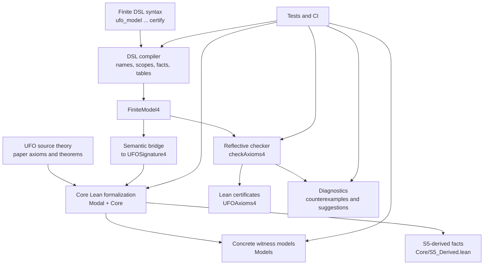
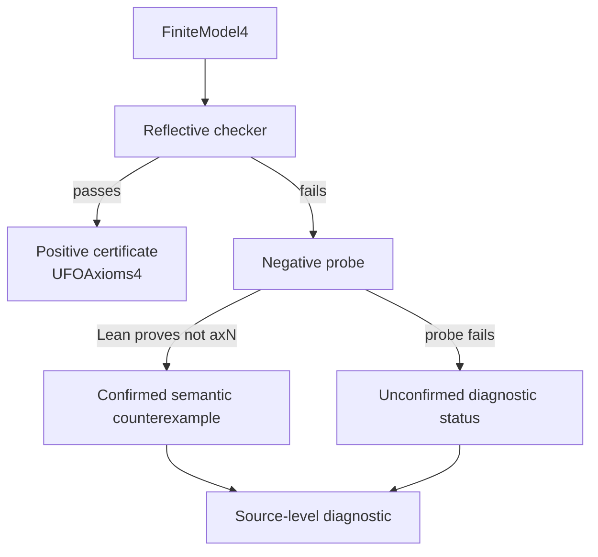

# Project Architecture

[Docs home](README.md) · [Project README](../README.md)

Lean UFO has two connected layers:

1. a semantic Lean formalization of UFO fragments;
2. a finite DSL that compiles small named models and certifies them against the
   formalized axiom package.

This page gives the project-level map. For the detailed DSL compiler/checker
pipeline, see the [DSL architecture](dsl/architecture.md).

## System Map



The core formalization is the semantic target. The DSL does not define a
separate ontology: it builds finite `UFOSignature4` interpretations and proves
that they satisfy the same `UFOAxioms4` package used by the rest of the
repository.

## Core Formalization

The core lives under `LeanUfo/UFO/`.

| Area | Purpose |
| --- | --- |
| `Modal/` | Semantic modal infrastructure, including S5-style Kripke semantics |
| `Core/Signature*.lean` | UFO semantic signatures for successive fragments |
| `Core/Section*.lean` | Axiom packages and derived theorems for those fragments |
| `Core/S5_Derived.lean` | Additional consequences of the chosen S5 semantics |
| `Models/` | Small concrete witness models and consistency checkpoints |

Each core fragment follows the same pattern:

```text
semantic signature
  -> axiom package
  -> derived theorems
  -> concrete witness model
  -> consistency checkpoint
```

The consistency checkpoints are model-existence theorems. They establish joint
satisfiability of the packaged semantic axioms relative to Lean's metatheory and
the chosen S5 semantics. They are not proof-theoretic consistency results.

## Finite DSL Layer

The DSL lives under `LeanUfo/UFO/DSL/`.

It lets a user write a compact finite model:

```lean
ufo_model Example : UFO where
  worlds actual
  things Person Alice

  given actual:
    ObjectKind(Person)
    Object(Alice)
    Alice :: Person

  derive_relations
  certify
```

The DSL architecture has its own detailed page:

- [DSL architecture](dsl/architecture.md): syntax, parser, compiler, finite
  model representation, reflective checker, positive and negative certificates,
  diagnostics, and formal complexity results;
- [DSL developer guide](dsl/developer-guide.md): file responsibilities and
  maintenance rules;
- [DSL syntax reference](dsl/syntax.md): user-facing grammar and fact forms.

At the project level, the important point is that `certify` emits ordinary Lean
declarations:

```lean
Example.certified : UFOAxioms4 Example.sig
```

So a successful DSL model is not merely accepted by a custom tool. It leaves a
Lean-checked theorem proving that the generated finite semantic signature
satisfies the encoded UFO axioms.

## Certificates And Diagnostics

The DSL has two proof-related paths.



Positive certification is the trusted success path. For registered axiom fields,
the generated theorem calls a reusable checker soundness theorem and evaluates
the finite model with `native_decide`.

Diagnostics are explanatory. A failed model is only a confirmed semantic
counterexample when Lean checks a proof of the failed axiom's negation for the
generated finite model. Otherwise the diagnostic reports missing witness data,
a timeout-style probe limit, or an unclassified probe failure.

## Formal Guarantees

The main guarantee layers are:

- **core semantic theorems** in `Core/Section*.lean` and `Core/S5_Derived.lean`;
- **witness-model consistency checkpoints** in `Models/`;
- **DSL compiler and packaging guarantees** in `DSL/Guarantees.lean` and
  `DSL/Certification.lean`;
- **checker soundness/completeness theorems** in `DSL/Checker/Soundness.lean`;
- **checker step bounds** in `DSL/Checker/Complexity.lean`.

The central DSL checker theorem is:

```lean
checkAxioms4_sound :
  checkAxioms4 M = true ->
  UFOAxioms4 M.toUFOSignature4
```

This theorem connects the executable finite checker to the Prop-valued semantic
axiom package.

## Trust Boundary

The trusted boundary is intentionally explicit.

- The core formalization is ordinary Lean code checked by the kernel.
- The concrete DSL parser and declaration emitter are trusted
  metaprogramming.
- After parsing, the main compiler pipeline is pure Lean data transformation.
- Generated declarations are checked by the Lean kernel.
- The diagnostics widget is presentation only; it is not proof evidence.

The [DSL architecture](dsl/architecture.md) gives the more detailed trust
boundary for each DSL transformation.

## Tests And CI

The test layer (i.e., **test coverage and negative witness coverage** under `LeanUfo/Test/`) checks several different claims:

- positive DSL examples still certify;
- negative fixtures fail at the intended axiom;
- direct negative fixtures produce Lean-confirmed counterexamples;
- diagnostic rendering remains coherent;
- selected axiom runs can target a subset of semantic witnesses;
- full semantic tests can be run separately from the fast profile.

Useful entry points:

```bash
lake test
LEANUFO_AXIOMS=ax68 lake test
LEANUFO_FULL_TESTS=1 lake test
```

`LEANUFO_REQUIRE_DIRECT_WITNESSES=1 lake test` is a stricter backfill audit and
is expected to fail until every registered axiom has a direct negative fixture.

See the [testing guide](testing.md) for the current test profiles and CI
expectations.

## Reading Next

- [Theoretical notes](theory.md) for modal choices, milestones, S5 consequences,
  and explicit bridge assumptions.
- [DSL architecture](dsl/architecture.md) for the finite DSL pipeline and
  checker.
- [Formal guarantees](guarantees.md) for the theorem-backed parts of the DSL
  pipeline.
- [Current status](status.md) for implemented coverage and current caveats.
