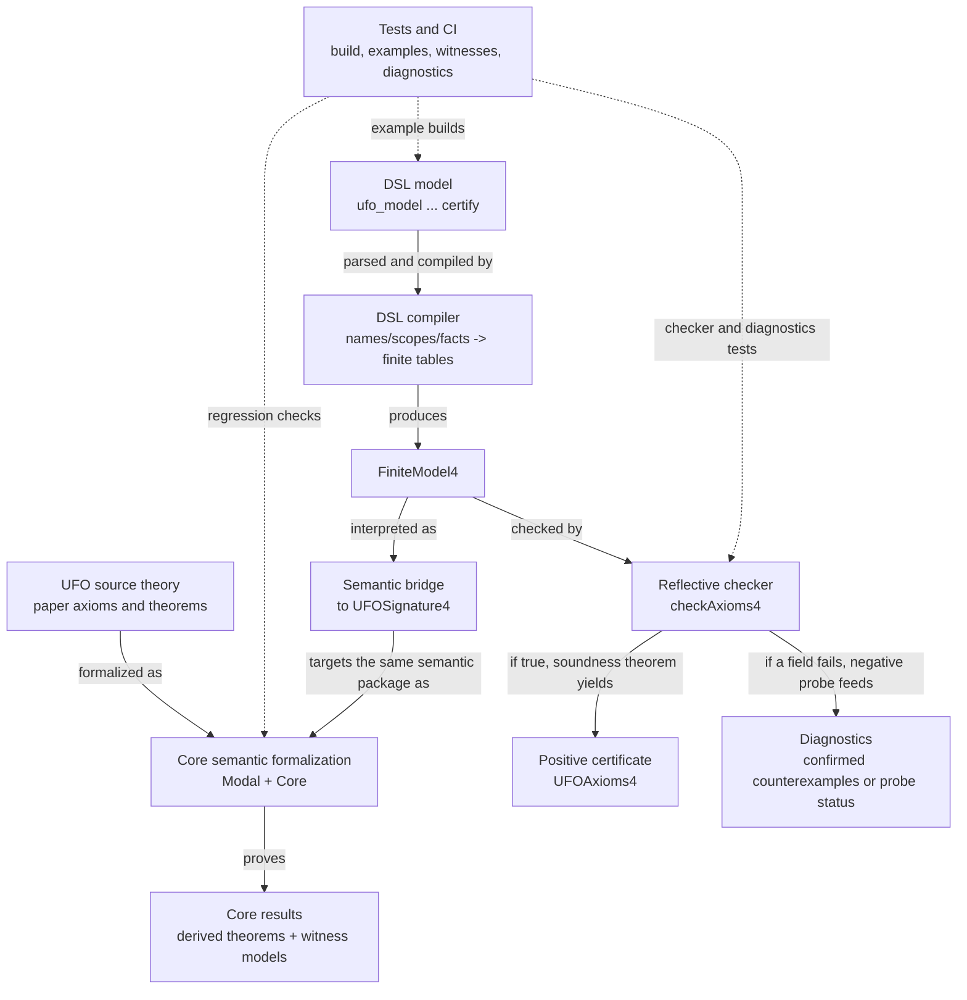
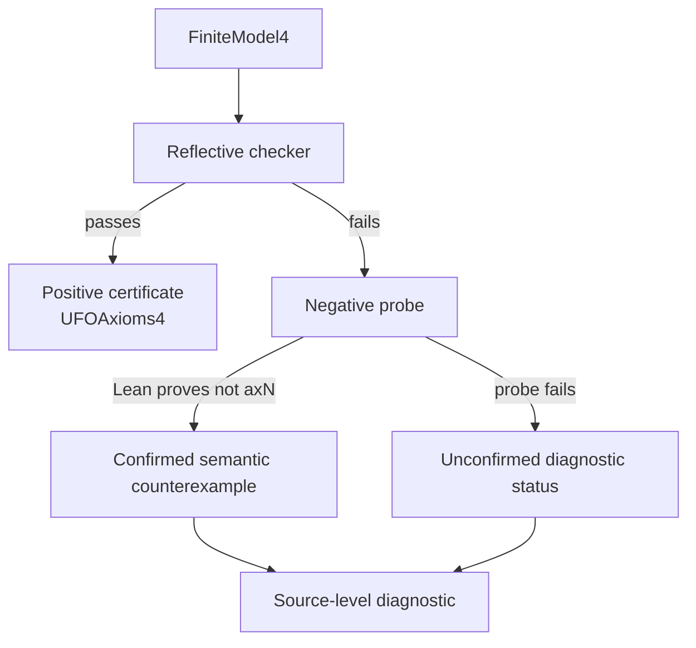

# Project architecture

[Docs home](README.md) · [Project README](../README.md)

## Overview

Lean UFO connects an ontology theory to a finite-model tool. The core states
the UFO axioms in Lean. The DSL turns named facts into tables, checks them,
and builds certificates for successful models.

The [theoretical notes](theory.md) explain the UFO and possible-world semantics
behind the core. The [complexity guide](dsl/complexity.md#references) records the
research behind counted algorithms and implementation proofs. This page shows
which layer owns each task and how a model reaches a checked theorem.

Lean UFO has two connected layers:

1. a semantic Lean formalization of UFO fragments;
2. a finite DSL that compiles small named models and certifies them against the
   formalized axiom package.

The diagram below shows how the semantic formalization, finite DSL, generated
proofs, diagnostics, and tests fit together. The [DSL architecture](dsl/architecture.md)
covers the compiler and checker in detail.

## System map


```mermaid
flowchart TD
  A["UFO source theory<br/>paper axioms and theorems"]
  B["Core semantic formalization<br/>Modal + Core"]
  C["Core results<br/>derived theorems + witness models"]

  D["DSL model<br/>ufo_model ... certify"]
  E["DSL compiler<br/>names/scopes/facts -> finite tables"]
  F["FiniteModel4"]
  G["Semantic bridge<br/>to UFOSignature4"]
  H["Reflective checker<br/>checkAxioms4"]
  I["Positive certificate<br/>UFOAxioms4"]
  J["Diagnostics<br/>confirmed counterexamples or probe status"]

  K["Tests and CI<br/>build, examples, witnesses, diagnostics"]

  A -->|"formalized as"| B
  B -->|"proves"| C

  D -->|"parsed and compiled by"| E
  E -->|"produces"| F
  F -->|"interpreted as"| G
  G -->|"targets the same semantic package as"| B
  F -->|"checked by"| H
  H -->|"if true, soundness theorem yields"| I
  H -->|"if a field fails, negative probe feeds"| J

  K -. "regression checks" .-> B
  K -. "example builds" .-> D
  K -. "checker and diagnostics tests" .-> H
```

The core formalization is the semantic target. The DSL does not define a
separate ontology: it builds finite `UFOSignature4` interpretations and proves
that they satisfy the same `UFOAxioms4` package used by the rest of the
repository.

## Core formalization

The core lives under `LeanUfo/UFO/`.

| Area | Purpose |
| --- | --- |
| `Modal/` | Semantic modal infrastructure, including S5-style Kripke semantics |
| `Core/Signature*.lean` | UFO semantic signatures for successive fragments |
| `Core/Section*.lean` | Axiom packages and derived theorems for those fragments |
| `Core/S5_Derived.lean` | Additional consequences of the chosen S5 semantics |
| `FormalAnalysis/` | Axiom diagnosis, historical comparisons, anti-vacuity interpretations, and satisfiability models |
| `FormalAnalysis/Satisfiability/` | Ordinary `ModelX` checkpoints and the positive-relator model chain |
| `FormalAnalysis/AntiVacuity/` | Stronger simultaneous-nonemptiness interpretations |

Each core fragment follows the same pattern:

```text
semantic signature
  -> axiom package
  -> derived theorems
  -> concrete witness model
  -> consistency checkpoint
```

The consistency checkpoints are model-existence theorems. They establish joint
satisfiability of the packaged semantic axioms relative to Lean's metatheory and
the chosen S5 semantics. They are not proof-theoretic consistency results.

## Finite DSL layer

The DSL lives under `LeanUfo/UFO/DSL/`.

It lets a user write a compact finite model:

```lean
ufo_model Example : UFO where
  worlds actual
  things Person Alice

  given actual:
    ObjectKind(Person)
    Object(Alice)
    Alice :: Person

  derive_relations
  certify
```

The DSL architecture has its own detailed page:

- [DSL architecture](dsl/architecture.md): syntax, parser, compiler, finite
  model representation, reflective checker, positive and negative certificates,
  diagnostics, and formal complexity results;
- [DSL developer guide](dsl/developer-guide.md): file responsibilities and
  maintenance rules;
- [DSL syntax reference](dsl/syntax.md): user-facing grammar and fact forms.

At the project level, `certify` emits ordinary Lean
declarations:

```lean
Example.certified : UFOAxioms4 Example.sig
```

A successful DSL model leaves a Lean-checked theorem that its generated finite
semantic signature satisfies the encoded UFO axioms. Acceptance by the command
frontend alone is not the certificate.

## Certificates and diagnostics

The DSL has two proof-related paths.


```mermaid
flowchart TD
  A["FiniteModel4"] --> B["Reflective checker"]
  B -->|passes| C["Positive certificate<br/>UFOAxioms4"]
  B -->|fails| D["Negative probe"]
  D -->|Lean proves not axN| E["Confirmed semantic counterexample"]
  D -->|probe fails| F["Unconfirmed diagnostic status"]
  E --> G["Source-level diagnostic"]
  F --> G
```

For registered axiom fields, the shared executor runs the requested Boolean
checks through Lean's `nativeEqTrue` API and inserts the resulting proofs into
generated declarations. Reusable soundness theorems connect those Boolean
results to the UFO axioms. Lean's native evaluator is part of this trust boundary.

Diagnostics are explanatory. A failed model is only a confirmed semantic
counterexample when Lean checks a proof of the failed axiom's negation for the
generated finite model. Otherwise the diagnostic reports missing witness data,
a timeout-style probe limit, or an unclassified probe failure.

## Formal guarantees

[Formal guarantees](guarantees.md) maps the following guarantee layers to their
Lean theorems:

- **core semantic theorems** in `Core/Section*.lean` and `Core/S5_Derived.lean`;
- **ordinary witness-model consistency checkpoints** in `FormalAnalysis/Satisfiability/`;
- **stronger simultaneous-nonemptiness checks** in `FormalAnalysis/AntiVacuity/`;
- **DSL compiler and packaging guarantees** in `DSL/Guarantees.lean` and
  `DSL/Certification.lean`;
- **checker soundness/completeness theorems** in `DSL/Checker/Soundness.lean`;
- **operational compiler/checker complexity guarantees** under
  `DSL/Complexity/`, including the fixed 116-check heterogeneous bound.
  `Complexity/Taxonomy.lean` owns the fixed unary parent graph and its counted,
  duplicate-free ancestor traversal. Model-dependent inherence reachability
  belongs to `Complexity/Closure.lean`. Counted validation of supplied axiom 99
  witnesses is in `Complexity/Diagnostics/ProductFamily.lean`; diagnostic report
  selection and rendering belong to `Diagnostic/AxiomAnalysis.lean`.
  `Diagnostic/DerivedAssertions.lean` owns preliminary checks and reports for
  user-written derived claims. `Diagnostic/Analysis.lean` aggregates both paths.
  The [complexity guide](dsl/complexity.md)
  states the remaining operational-accounting and pipeline obligations.

The central DSL checker theorem is:

```lean
checkAxioms4_sound :
  checkAxioms4 M = true ->
  UFOAxioms4 M.toUFOSignature4
```

The theorem connects the executable finite checker to the Prop-valued semantic
axiom package. The formal-guarantees page gives the more detailed theorem map
for name resolution, table compilation, semantic bridging, checker
soundness and completeness, certificate reuse, diagnostics, and operational
cost bounds.

## Trust boundary

The trusted boundary is explicit.

- The core formalization is ordinary Lean code checked by the kernel.
- The concrete DSL parser and declaration emitter are trusted
  metaprogramming.
- After parsing, the main compiler pipeline is pure Lean data transformation.
- Generated declarations are checked by the Lean kernel.
- The diagnostics widget is presentation only; it is not proof evidence.

The [DSL architecture](dsl/architecture.md) gives the more detailed trust
boundary for each DSL transformation.

## Tests and CI

The tests under `LeanUfo/Test/` cover both regression behavior and negative
witnesses:

- positive DSL examples still certify;
- negative fixtures fail at the intended axiom;
- direct negative fixtures produce Lean-confirmed counterexamples;
- diagnostic rendering remains coherent;
- selected axiom runs can target a subset of semantic witnesses;
- full semantic tests can be run separately from the fast profile.

Useful entry points:

```bash
lake test
LEANUFO_AXIOMS=ax68 lake test
LEANUFO_FULL_TESTS=1 lake test
```

`LEANUFO_REQUIRE_DIRECT_WITNESSES=1 lake test` is a stricter backfill audit and
is expected to fail until every registered axiom has a direct negative fixture.

See the [testing guide](testing.md) for the current test profiles and CI
expectations.

## Reading next

- [Theoretical notes](theory.md) for modal choices, milestones, S5 consequences,
  and explicit bridge assumptions.
- [DSL architecture](dsl/architecture.md) for the finite DSL pipeline and
  checker.
- [Formal guarantees](guarantees.md) for theorem-backed guarantees across the
  core, DSL compiler, checker, reuse, diagnostics, and complexity layers.
- [Current status](status.md) for implemented coverage and current caveats.
