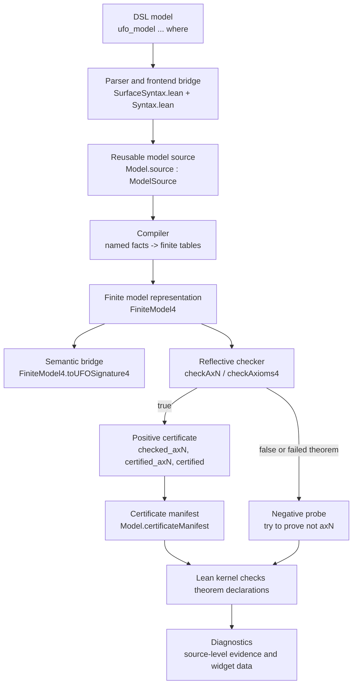
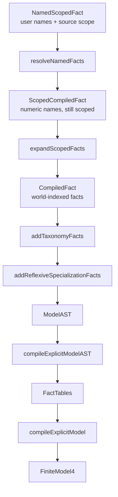
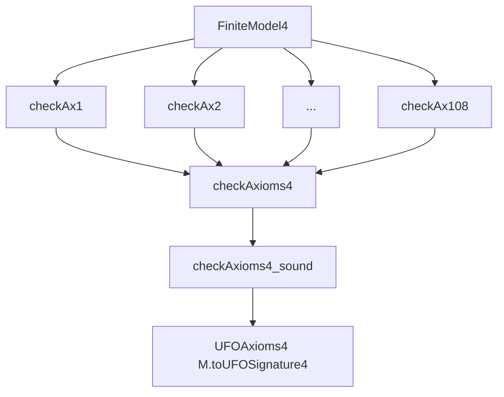
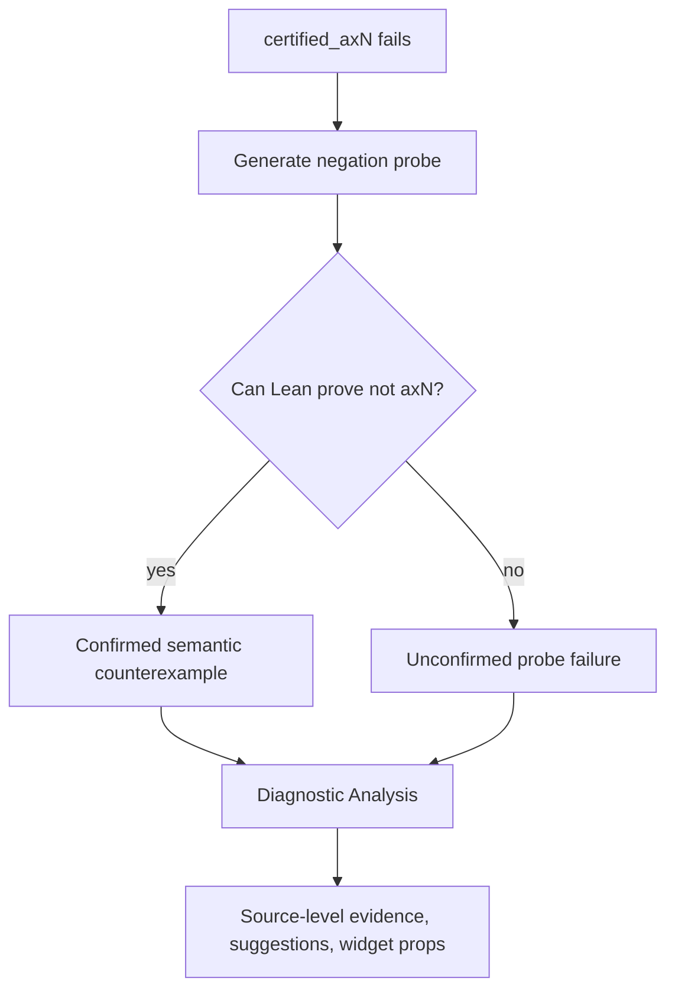

# DSL Architecture

[Docs home](../README.md) · [Developer guide](developer-guide.md) · [Project README](../../README.md)

This page explains the architecture of the finite UFO DSL from the user-facing
syntax down to Lean-checked certificates and diagnostics. It is meant to give a
developer enough structure to know where a change belongs and which formal
guarantees are already proved.

## High-Level Ingredients

At a high level, a `ufo_model` command is transformed through five layers:

1. user syntax;
2. parsing and name resolution;
3. pure finite-model compilation;
4. reflective Boolean checking;
5. certificate generation and diagnostics.



The positive path proves ordinary Lean declarations such as:

```lean
Model.checked_axN   : checkAxN Model.data = true
Model.certified_axN : ax_aN Model.sig...
Model.certified     : UFOAxioms4 Model.sig
```

For checker-backed fields, the generated theorem has the shape:

```lean
theorem Model.certified_axN : ax_aN Model.sig... :=
  LeanUfo.UFO.DSL.Checker.checkAxN_sound Model.data (by native_decide)
```

The negative path is separate. If certification stops at `axN`, diagnostics try
to prove:

```lean
¬ ax_aN Model.sig...
```

When that negation proof succeeds, the failure is a confirmed semantic
counterexample. When it does not, the diagnostic reports an unconfirmed probe
failure, not a semantic result.

## What Is Proved Where

The pipeline deliberately separates trusted metaprogramming from theorem-backed
pure Lean code.

| Stage | Main files | Formal status |
| --- | --- | --- |
| Surface grammar and command elaboration | `Frontend/SurfaceSyntax.lean`, `Syntax.lean` | Trusted frontend/metaprogramming |
| Name and scope compilation | `Compiler.lean`, `Compiler/AST.lean`, `Compiler/Fields.lean` | Pure functions, with pipeline guarantees in `Guarantees.lean` |
| Finite model tables | `FiniteModel.lean` | Ordinary Lean data compiled to a Prop-valued UFO signature |
| Semantic bridge | `FiniteModel4.toUFOSignature4` in `FiniteModel.lean` | Defines the semantic interpretation checked by the core axioms |
| Positive checker | `Checker/Axioms.lean`, `Checker/Soundness.lean` | Soundness proves `checkAxN = true -> ax_aN`; most fields also have completeness |
| Aggregate checker | `Checker/Axioms.lean`, `Checker/Soundness.lean` | `checkAxioms4_sound` proves `checkAxioms4 = true -> UFOAxioms4` |
| Step bounds | `Checker/Steps.lean`, `Checker/Complexity.lean` | Formal polynomial bounds for abstract checker steps |
| Certificate source generation | `Certificate/Generation.lean` | Trusted code emission, checked afterward by the Lean kernel |
| Diagnostics | `Diagnostic/Analysis.lean`, `Diagnostic/Widget.lean` | Explanatory layer; confirmed counterexamples rely on Lean-checked negation proofs |

The central guarantee for successful certification is:

```lean
checkAxioms4_sound :
  checkAxioms4 M = true ->
  UFOAxioms4 M.toUFOSignature4
```

This means that if the generated finite model passes the reflective checker,
Lean can construct a proof that the corresponding semantic signature satisfies
the encoded UFO axiom package.

## Syntax And Parser

The user writes a compact named model:

```lean
ufo_model Minimal : UFO where
  worlds actual
  things Person Alice

  given actual:
    ObjectKind(Person)
    Object(Alice)
    Alice :: Person

  derive_relations
  certify
```

The frontend layer is responsible for:

- declaring the grammar accepted by `ufo_model`;
- collecting world names, thing names, facts, and directives;
- translating concrete syntax into internal data;
- emitting `Model.source`, a reusable `ModelSource` value containing the parsed
  model before name resolution;
- emitting Lean declarations and certificate commands.

The relevant files are:

- `Frontend/SurfaceSyntax.lean`: concrete grammar only;
- `Frontend/ModelText.lean`: rendering and name-to-field text helpers;
- `Syntax.lean`: command elaboration, declaration emission, certificate checks,
  and diagnostic storage.

This layer is intentionally thin, but it is trusted metaprogramming: Lean checks
the declarations it emits, but the parser/emitter itself is not proved correct
as a compiler.

## Compiler

The compiler is the pure middle of the DSL. Its job is to turn user-facing
named facts into compact finite tables.



The important compiler ingredients are:

- **name resolution**: rejects duplicate names and unknown names;
- **scope expansion**: expands `given everywhere:` into one fact per declared
  world;
- **taxonomy expansion**: adds encoded UFO taxonomy ancestors implied by
  classifications such as `ObjectKind(Person)`;
- **reflexive specialization insertion**: adds facts such as `Person ⊑ Person`
  where the encoded specialization axioms require them;
- **table compilation**: builds Boolean finite tables for unary predicates,
  binary relations, ternary relations, membership, tuple projection, distance,
  and product-family witnesses.

The main files are:

- `Compiler.lean`;
- `Compiler/AST.lean`;
- `Compiler/Fields.lean`.

Generic compiler guarantees are collected in `Guarantees.lean`. These prove
properties of the pipeline as pure Lean transformations, for example that
expanded facts and generated tables are related in the intended way.

The compiler also exposes `extendModelSource`, used by:

```lean
ufo_model Child : UFO extends Parent : UFO where
  ...
```

The current extension semantics is intentionally conservative: a child model may
add things, facts, and product-family witnesses, but it may not add worlds. This
keeps parent `everywhere` facts stable until we explicitly choose an
added-world scoping semantics.

## Finite Model Representation

`FiniteModel4` is the executable representation checked by the DSL backend. It
stores finite domains and table-valued interpretations:

- `worldCount`;
- `thingCount`;
- unary predicate tables;
- relation tables;
- set-membership and tuple-projection tables;
- product-family witness data used by `ax99`.

The semantic bridge is:

```lean
FiniteModel4.toUFOSignature4 : UFOSignature4
```

This bridge turns finite Boolean tables into the ordinary Prop-valued UFO
signature used by the core formalization. The checker and the generated
certificates are therefore not checking a separate logic: they check that this
finite table interpretation satisfies the same `UFOAxioms4` package used by the
rest of the repository.

## Reflective Checker

The reflective checker is an executable Boolean validator for finite models.
For each registered axiom field it provides definitions of the form:

```lean
checkAxN   : FiniteModel4 -> Bool
checkAxN_S : FiniteModel4 -> Stepped Bool
```

The plain checker returns the Boolean result. The stepped checker returns the
same Boolean result together with an abstract step envelope. The envelope is a
syntactic upper bound used for formal polynomial statements; it is not an exact
operation counter.

The key change is that semantic certification is now driven by explicit finite
computation rather than by asking Lean tactics to rediscover a proof for each
generated model. The old shape was:

```text
finite model
  -> large unfolded Prop goal
  -> broad automation (`simp`, `omega`, `grind`, `decide`)
  -> proof found, timeout, or unclassified tactic failure
```

That approach was correct when it succeeded, because Lean still checked the
generated theorem. But the work was delegated to open-ended proof search over a
large generated proposition. A failure could mean that the model was invalid, or
that automation got stuck, or that a heartbeat/typeclass/decidability limit was
hit.

The checker-backed shape is:

```text
finite model
  -> explicit Boolean computation (`checkAxN`)
  -> `native_decide` evaluates the concrete Boolean result
  -> reusable soundness theorem turns `true` into the semantic axiom proof
```

For example, a generated certificate field has the form:

```lean
theorem Model.certified_axN : ax_aN Model.sig... :=
  checkAxN_sound Model.data (by native_decide)
```

The Boolean function `checkAxN` is ordinary Lean code that scans the compiled
finite tables: worlds, things, instantiation, specialization, classifications,
relations, membership, tuple projections, distances, and product-family
witnesses. The reusable theorem `checkAxN_sound` is proved once in
`Checker/Soundness.lean`; each concrete model only has to evaluate the Boolean
checker. This makes the semantic certification algorithm explicit and
predictable, and it is what enables the formal step bounds in
`Checker/Complexity.lean`.



The main checker files are:

- `Checker/Basic.lean`: shared finite scans such as all-world and all-thing
  loops;
- `Checker/Axioms.lean`: executable axiom checkers;
- `Checker/Soundness.lean`: soundness and completeness theorems;
- `Checker/Steps.lean`: abstract step-envelope definitions;
- `Checker/Complexity.lean`: formal step bounds.

The standard per-axiom theorem pattern is:

```lean
checkAxN_sound :
  checkAxN M = true ->
  ax_aN M.toUFOSignature4...
```

For direct negative witnesses and many internal arguments, the checker also
proves:

```lean
checkAxN_complete :
  ax_aN M.toUFOSignature4... ->
  checkAxN M = true

checkAxN_correct :
  checkAxN M = true <-> ax_aN M.toUFOSignature4...
```

`ax99` is the important exception. The checker is sound for the core axiom, but
full negative interpretation of `checkAx99 = false` requires explicit product
family witness completeness:

```lean
ProductFamilyWitnessTableComplete M
```

Without that condition, `checkAx99 = false` means that the finite model lacks
stored witness data, not necessarily that the semantic axiom is false.

## Positive Certificates

Positive certification is the normal success path. The command emits one theorem
per registered axiom and a final bundled theorem:

```lean
Model.checked_ax1     : checkAx1 Model.data = true
Model.certified_ax1   : ax_a1 Model.sig.toUFOSignature3_1
Model.certified_ax2   : ax_a2 Model.sig.toUFOSignature3_1
-- ...
Model.certified_ax108 : ax_a108 Model.sig

Model.certified : UFOAxioms4 Model.sig
```

The per-axiom theorem calls the corresponding checker soundness theorem and
uses `native_decide` to evaluate the concrete generated model:

```lean
exact LeanUfo.UFO.DSL.Checker.checkAxN_sound data (by native_decide)
```

The command now also emits a stored Boolean check theorem per field:

```lean
Model.checked_axN : checkAxN Model.data = true
```

These `checked_axN` declarations are the reusable certificate atoms. The public
semantic theorem names stay unchanged (`certified_axN`, `certified`,
`certifiedModel`), while the manifest records which check theorem belongs to
which axiom field. Ordinary `certify` may reuse a parent model's check theorem
when either the whole `ModelSource` is unchanged or the registered table
footprint for that axiom is unchanged. `certify_fresh` disables this reuse plan
and forces fresh check theorem generation.

Each certified model also emits:

```lean
Model.certificateManifest : CertificateManifest
```

The manifest is provenance and export metadata, not proof evidence. It records
the model name, Lean version, axiom package, checker name, source and finite
model fingerprints, per-field theorem names, and whether a field was checked
fresh or reused. The Lean theorem declarations remain the authoritative
certificate. The Lean declaration stores compact structural fingerprints and
stable internal IDs; the exporter enriches the JSON manifest with SHA-256
digests of the generated source and finite-table representations.

The footprint-backed reuse registry lives in
`LeanUfo/UFO/DSL/Certificate/Reuse.lean`. It contains one explicit footprint row
for every registered certificate field. A footprint lists the primitive finite
tables read by that field's checker: unary tables, binary tables, ternary
tables, tuple projections, and product-family witnesses. Representative fields:

- `ax13`: unchanged `Endurant` and `Perdurant` footprint;
- `ax61`: unchanged `ConstitutedBy` footprint;
- `ax68`: unchanged `Moment` and `InheresIn` footprint;
- `ax101`: unchanged `Quale` and `Distance` footprint.

The registry is intentionally explicit. A row is only a reuse plan, not proof
evidence. The command generator first asks the registry whether reuse looks
possible, then emits a child `checked_axN` theorem that proves by computation:

```lean
checkAxN Child.data = checkAxN Parent.data
```

Only after Lean checks that equality does the theorem use
`Parent.checked_axN`. If the equality theorem does not elaborate, the generator
falls back to a fresh `checked_axN` proof for the child. The manifest records
the actual result after this fallback, so a field is marked `reused` only when a
Lean-checked reuse theorem was really emitted.

In all cases, reuse is still a Lean proof, not a trusted cache lookup. The
formal proof pattern is recorded in `Guarantees.lean`:

```lean
CertificateReuse.reused_checker_result_sound
CertificateReuse.reused_checker_semantic_sound
CertificateReuse.reused_aggregate_checker_certified_sound
CertificateReuse.certificateReuseSource_fresh_none
```

These theorems state that a reused child check is sound exactly when Lean has
proved equality with the parent check, and that semantic correctness still
comes from the same checker soundness theorem used by fresh certification.

The diagnostics widget receives the same fallback-aware reuse information for
completed fields. It shows a **Certificate reuse** section with reused and
fresh rows; a reused row names the parent `checked_axN` theorem used by the
child proof. If certification later fails, the section still shows the reuse
status for the fields completed before the failure.

The Lean manifest can be rendered as JSON via:

```lean
Model.certificateManifest.toJson
```

The Lake exporter writes these manifests to disk and enriches them with local
git metadata when available:

```bash
lake exe export-certificates --module LeanUfo.UFO.DSL.ConcreteExamples.ReuseModelExtension --out certificates/
lake exe validate-certificate certificates/CarBase.certificate.json --structure-only
lake exe validate-certificate certificates/CarBase.certificate.json --module LeanUfo.UFO.DSL.ConcreteExamples.ReuseModelExtension
```

If a module contains one or more `export_certificate ModelName` markers, the
exporter writes only those marked models. Otherwise it writes every certified
model it can find in the module source. The JSON value is metadata; the checked
Lean declarations remain the proof artifact. `--structure-only` checks JSON
shape. Default validation requires `--module`, rebuilds the module, checks that
the named Lean declarations have the expected certificate types, and compares
the regenerated SHA-256 digests and theorem names.

The final bundled theorem is assembled from the generated per-axiom proofs. The
Lean kernel checks all declarations, so a successful `certify` command leaves an
ordinary Lean theorem in the environment.

## Negative Certificates And Diagnostics

Negative certification is not part of the success path. It is a diagnostic
probe used after a model fails.



A direct negative fixture counts only when Lean proves the negation of the
failed axiom for the generated finite model. This is why diagnostics distinguish:

- **confirmed semantic counterexample**: Lean checked `not axN`;
- **missing witness data**: currently important for `ax99`;
- **timeout-style probe limit**: operational limit in the diagnostic probe;
- **unclassified probe failure**: no semantic conclusion.

`Diagnostic/Analysis.lean` reconstructs source-level evidence from the compiled
finite tables. It is explanatory, not foundational. The formal evidence remains
the Lean-checked certificate or negation theorem.

## Internal Formal Guarantees

The central theorem map is [Formal guarantees](../guarantees.md). The main DSL
guarantee layers are:

- compiler and table-pipeline properties in `Guarantees.lean`;
- per-axiom checker soundness in `Checker/Soundness.lean`;
- per-axiom completeness/correctness where available in
  `Checker/Soundness.lean`;
- aggregate checker soundness in `Checker/Soundness.lean`;
- checker value/step coherence and polynomial step bounds in
  `Checker/Complexity.lean`;
- finite-model certified packaging in `Certification.lean`.

The most important aggregate theorem is:

```lean
checkAxioms4_sound :
  checkAxioms4 M = true ->
  UFOAxioms4 M.toUFOSignature4
```

This is the theorem that justifies using the Boolean checker as the normal DSL
certification backend. For the detailed list of theorem names and what each
component guarantee means, use the formal-guarantees page.

## Formal Complexity Result

The formal complexity statements are also summarized in
[Formal guarantees](../guarantees.md). The checker has an abstract step-envelope
model:

```lean
structure Stepped (alpha : Type) where
  value : alpha
  steps : Nat
```

The theorem

```lean
checkAxioms4_S_value :
  (checkAxioms4_S M).value = checkAxioms4 M
```

states that the stepped checker computes the same Boolean result as the plain
checker.

The raw envelope constructor is:

```lean
Stepped.stepEnvelope M thingPow worldPow =
  (M.thingCount + 1)^thingPow * (M.worldCount + 1)^worldPow
```

Individual stepped axiom wrappers use `Stepped.axiomStepEnvelope` only where the
visible finite scans justify local exponents. Otherwise they use
`Stepped.axiomEnvelope`, the default wrapper backed by the global envelope.

The aggregate step-envelope bound is:

```lean
checkAxioms4_steps_bound :
  (checkAxioms4_S M).steps <=
    116 * Stepped.globalStepEnvelope M + 115
```

Here `globalStepEnvelope` is the conservative fallback envelope for checker
steps:

```lean
Stepped.globalStepEnvelope M =
  (M.thingCount + 1)^8 * (M.worldCount + 1)^4
```

There is also a one-variable input-size theorem. The thing/world component is:

```lean
modelSize M = (M.thingCount + 1) * (M.worldCount + 1)
```

The final size measure adds product-family witness arrays:

```lean
checkerInputSize M = modelSize M + productFamilyFootprint M + 1
```

These are abstract checker input measures. They are not byte-size measurements,
CPU-instruction counts, Lean kernel checking time, or Lake build time.

The corresponding theorem is:

```lean
checkAxioms4_steps_polynomial_in_checkerInputSize :
  exists C d k,
    forall M : FiniteModel4,
      (checkAxioms4_S M).steps <= C * (checkerInputSize M)^d + k
```

This proves that, under the abstract `Stepped` envelope model, semantic
finite-model checking is polynomial in the abstract checker input size. It does
not prove that every build is fast in wall-clock time: Lean still has to
elaborate generated declarations, run `native_decide`, compile modules, and
possibly run diagnostic negation probes. The value of the theorem is narrower
and stronger: the semantic checker itself is no longer open-ended tactic search.
