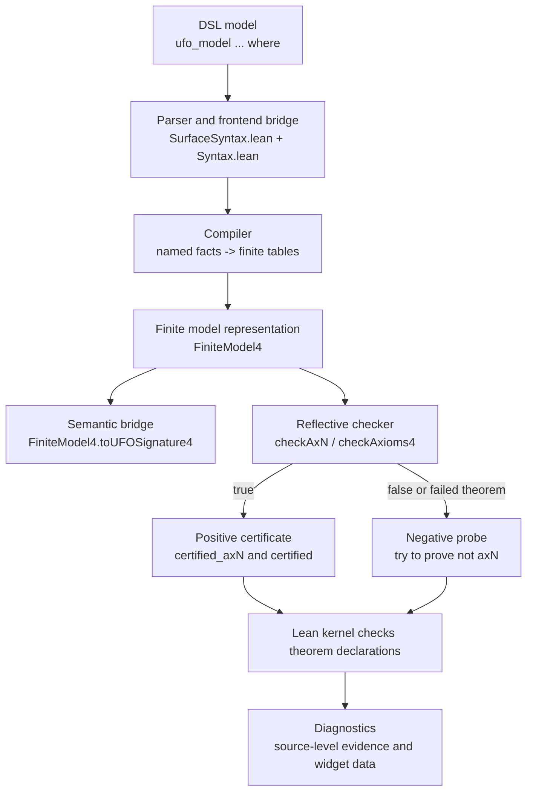
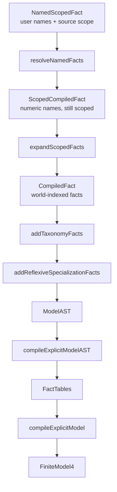
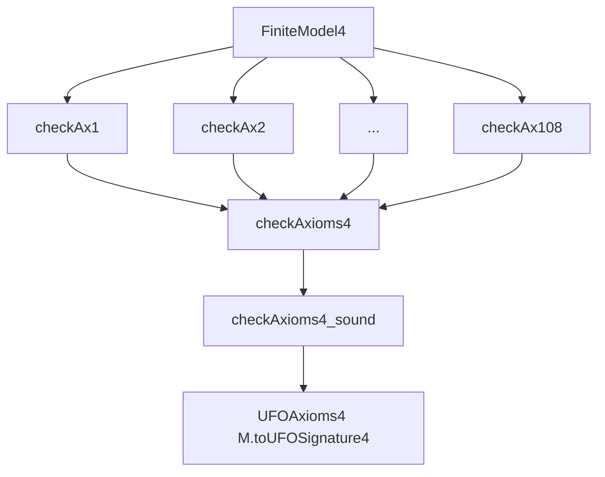
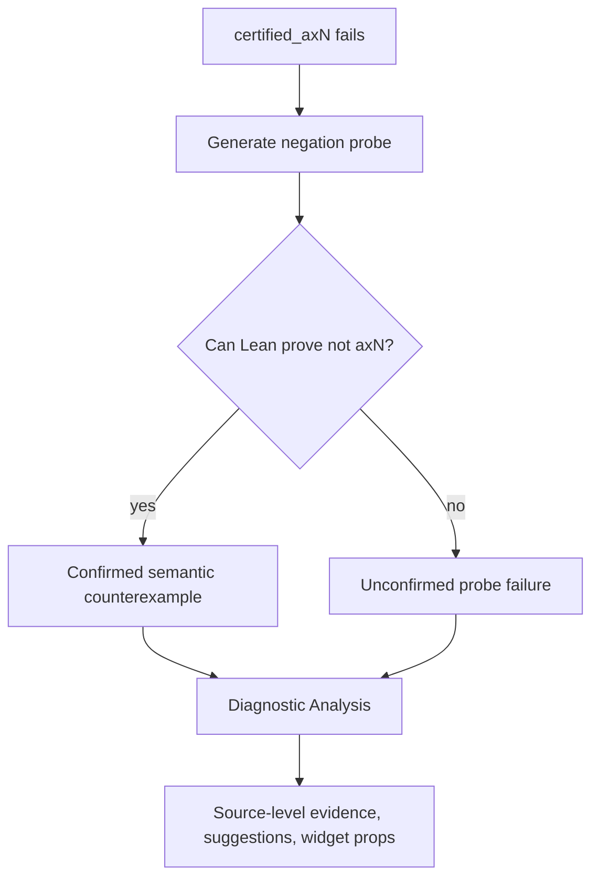

# DSL Architecture

[Docs home](../README.md) · [Developer guide](developer-guide.md) · [Project README](../../README.md)

This page explains the architecture of the finite UFO DSL from the user-facing
syntax down to Lean-checked certificates and diagnostics. It is meant to give a
developer enough structure to know where a change belongs and which formal
guarantees are already proved.

## High-Level Ingredients

At a high level, a `ufo_model` command is transformed through five layers:

1. user syntax;
2. parsing and name resolution;
3. pure finite-model compilation;
4. reflective Boolean checking;
5. certificate generation and diagnostics.



The positive path proves ordinary Lean declarations such as:

```lean
Model.certified_axN : ax_aN Model.sig...
Model.certified     : UFOAxioms4 Model.sig
```

For checker-backed fields, the generated theorem has the shape:

```lean
theorem Model.certified_axN : ax_aN Model.sig... :=
  LeanUfo.UFO.DSL.Checker.checkAxN_sound Model.data (by native_decide)
```

The negative path is separate. If certification stops at `axN`, diagnostics try
to prove:

```lean
¬ ax_aN Model.sig...
```

When that negation proof succeeds, the failure is a confirmed semantic
counterexample. When it does not, the diagnostic reports an unconfirmed probe
failure, not a semantic result.

## What Is Proved Where

The pipeline deliberately separates trusted metaprogramming from theorem-backed
pure Lean code.

| Stage | Main files | Formal status |
| --- | --- | --- |
| Surface grammar and command elaboration | `Frontend/SurfaceSyntax.lean`, `Syntax.lean` | Trusted frontend/metaprogramming |
| Name and scope compilation | `Compiler.lean`, `Compiler/AST.lean`, `Compiler/Fields.lean` | Pure functions, with pipeline guarantees in `Guarantees.lean` |
| Finite model tables | `FiniteModel.lean` | Ordinary Lean data compiled to a Prop-valued UFO signature |
| Semantic bridge | `FiniteModel4.toUFOSignature4` in `FiniteModel.lean` | Defines the semantic interpretation checked by the core axioms |
| Positive checker | `Checker/Axioms.lean`, `Checker/Soundness.lean` | Soundness proves `checkAxN = true -> ax_aN`; most fields also have completeness |
| Aggregate checker | `Checker/Axioms.lean`, `Checker/Soundness.lean` | `checkAxioms4_sound` proves `checkAxioms4 = true -> UFOAxioms4` |
| Step bounds | `Checker/Steps.lean`, `Checker/Complexity.lean` | Formal polynomial bounds for abstract checker steps |
| Certificate source generation | `Certificate/Generation.lean` | Trusted code emission, checked afterward by the Lean kernel |
| Diagnostics | `Diagnostic/Analysis.lean`, `Diagnostic/Widget.lean` | Explanatory layer; confirmed counterexamples rely on Lean-checked negation proofs |

The central guarantee for successful certification is:

```lean
checkAxioms4_sound :
  checkAxioms4 M = true ->
  UFOAxioms4 M.toUFOSignature4
```

This means that if the generated finite model passes the reflective checker,
Lean can construct a proof that the corresponding semantic signature satisfies
the encoded UFO axiom package.

## Syntax And Parser

The user writes a compact named model:

```lean
ufo_model Minimal : UFO where
  worlds actual
  things Person Alice

  given actual:
    ObjectKind(Person)
    Object(Alice)
    Alice :: Person

  derive_relations
  certify
```

The frontend layer is responsible for:

- declaring the grammar accepted by `ufo_model`;
- collecting world names, thing names, facts, and directives;
- translating concrete syntax into internal data;
- emitting Lean declarations and certificate commands.

The relevant files are:

- `Frontend/SurfaceSyntax.lean`: concrete grammar only;
- `Frontend/ModelText.lean`: rendering and name-to-field text helpers;
- `Syntax.lean`: command elaboration, declaration emission, certificate checks,
  and diagnostic storage.

This layer is intentionally thin, but it is trusted metaprogramming: Lean checks
the declarations it emits, but the parser/emitter itself is not proved correct
as a compiler.

## Compiler

The compiler is the pure middle of the DSL. Its job is to turn user-facing
named facts into compact finite tables.



The important compiler ingredients are:

- **name resolution**: rejects duplicate names and unknown names;
- **scope expansion**: expands `given everywhere:` into one fact per declared
  world;
- **taxonomy expansion**: adds encoded UFO taxonomy ancestors implied by
  classifications such as `ObjectKind(Person)`;
- **reflexive specialization insertion**: adds facts such as `Person ⊑ Person`
  where the encoded specialization axioms require them;
- **table compilation**: builds Boolean finite tables for unary predicates,
  binary relations, ternary relations, membership, tuple projection, distance,
  and product-family witnesses.

The main files are:

- `Compiler.lean`;
- `Compiler/AST.lean`;
- `Compiler/Fields.lean`.

Generic compiler guarantees are collected in `Guarantees.lean`. These prove
properties of the pipeline as pure Lean transformations, for example that
expanded facts and generated tables are related in the intended way.

## Finite Model Representation

`FiniteModel4` is the executable representation checked by the DSL backend. It
stores finite domains and table-valued interpretations:

- `worldCount`;
- `thingCount`;
- unary predicate tables;
- relation tables;
- set-membership and tuple-projection tables;
- product-family witness data used by `ax99`.

The semantic bridge is:

```lean
FiniteModel4.toUFOSignature4 : UFOSignature4
```

This bridge turns finite Boolean tables into the ordinary Prop-valued UFO
signature used by the core formalization. The checker and the generated
certificates are therefore not checking a separate logic: they check that this
finite table interpretation satisfies the same `UFOAxioms4` package used by the
rest of the repository.

## Reflective Checker

The reflective checker is an executable Boolean validator for finite models.
For each registered axiom field it provides definitions of the form:

```lean
checkAxN   : FiniteModel4 -> Bool
checkAxN_S : FiniteModel4 -> Stepped Bool
```

The plain checker returns the Boolean result. The stepped checker returns the
same Boolean result together with an abstract step count.



The main checker files are:

- `Checker/Basic.lean`: shared finite scans such as all-world and all-thing
  loops;
- `Checker/Axioms.lean`: executable axiom checkers;
- `Checker/Soundness.lean`: soundness and completeness theorems;
- `Checker/Steps.lean`: abstract step accounting;
- `Checker/Complexity.lean`: formal step bounds.

The standard per-axiom theorem pattern is:

```lean
checkAxN_sound :
  checkAxN M = true ->
  ax_aN M.toUFOSignature4...
```

For direct negative witnesses and many internal arguments, the checker also
proves:

```lean
checkAxN_complete :
  ax_aN M.toUFOSignature4... ->
  checkAxN M = true

checkAxN_correct :
  checkAxN M = true <-> ax_aN M.toUFOSignature4...
```

`ax99` is the important exception. The checker is sound for the core axiom, but
full negative interpretation of `checkAx99 = false` requires explicit product
family witness completeness:

```lean
ProductFamilyWitnessTableComplete M
```

Without that condition, `checkAx99 = false` means that the finite model lacks
stored witness data, not necessarily that the semantic axiom is false.

## Positive Certificates

Positive certification is the normal success path. The command emits one theorem
per registered axiom and a final bundled theorem:

```lean
Model.certified_ax1   : ax_a1 Model.sig.toUFOSignature3_1
Model.certified_ax2   : ax_a2 Model.sig.toUFOSignature3_1
-- ...
Model.certified_ax108 : ax_a108 Model.sig

Model.certified : UFOAxioms4 Model.sig
```

The per-axiom theorem calls the corresponding checker soundness theorem and
uses `native_decide` to evaluate the concrete generated model:

```lean
exact LeanUfo.UFO.DSL.Checker.checkAxN_sound data (by native_decide)
```

The final bundled theorem is assembled from the generated per-axiom proofs. The
Lean kernel checks all declarations, so a successful `certify` command leaves an
ordinary Lean theorem in the environment.

## Negative Certificates And Diagnostics

Negative certification is not part of the success path. It is a diagnostic
probe used after a model fails.



A direct negative fixture counts only when Lean proves the negation of the
failed axiom for the generated finite model. This is why diagnostics distinguish:

- **confirmed semantic counterexample**: Lean checked `not axN`;
- **missing witness data**: currently important for `ax99`;
- **timeout-style probe limit**: operational limit in the diagnostic probe;
- **unclassified probe failure**: no semantic conclusion.

`Diagnostic/Analysis.lean` reconstructs source-level evidence from the compiled
finite tables. It is explanatory, not foundational. The formal evidence remains
the Lean-checked certificate or negation theorem.

## Internal Formal Guarantees

The main formal guarantees are:

- compiler and table-pipeline properties in `Guarantees.lean`;
- per-axiom checker soundness in `Checker/Soundness.lean`;
- per-axiom completeness/correctness where available in
  `Checker/Soundness.lean`;
- aggregate checker soundness in `Checker/Soundness.lean`;
- checker value/step coherence and polynomial step bounds in
  `Checker/Complexity.lean`;
- finite-model certified packaging in `Certification.lean`.

The most important aggregate theorem is:

```lean
checkAxioms4_sound :
  checkAxioms4 M = true ->
  UFOAxioms4 M.toUFOSignature4
```

This is the theorem that justifies using the Boolean checker as the normal DSL
certification backend.

## Formal Complexity Result

The checker has an abstract step model:

```lean
structure Stepped (alpha : Type) where
  value : alpha
  steps : Nat
```

The theorem

```lean
checkAxioms4_S_value :
  (checkAxioms4_S M).value = checkAxioms4 M
```

states that the stepped checker computes the same Boolean result as the plain
checker.

The two-dimensional polynomial bound is:

```lean
finite_checker_polynomial_bound :
  exists C a b,
    forall M : FiniteModel4,
      (checkAxioms4_S M).steps <=
        C * (M.thingCount + 1)^a * (M.worldCount + 1)^b + 115
```

There is also a one-variable model-size theorem. The model size is:

```lean
modelSize M = (M.thingCount + 1) * (M.worldCount + 1)
```

It counts the abstract finite thing/world positions used by the checker. It is
not a byte-size measurement, a CPU-instruction count, Lean kernel checking time,
or Lake build time.

The corresponding theorem is:

```lean
checkAxioms4_steps_polynomial_in_modelSize :
  exists C d k,
    forall M : FiniteModel4,
      (checkAxioms4_S M).steps <= C * (modelSize M)^d + k
```

This proves that, under the abstract `Stepped` model, semantic finite-model
checking is polynomial in the generated finite model size. It does not prove
that every build is fast in wall-clock time: Lean still has to elaborate
generated declarations, run `native_decide`, compile modules, and possibly run
diagnostic negation probes. The value of the theorem is narrower and stronger:
the semantic checker itself is no longer open-ended tactic search.

