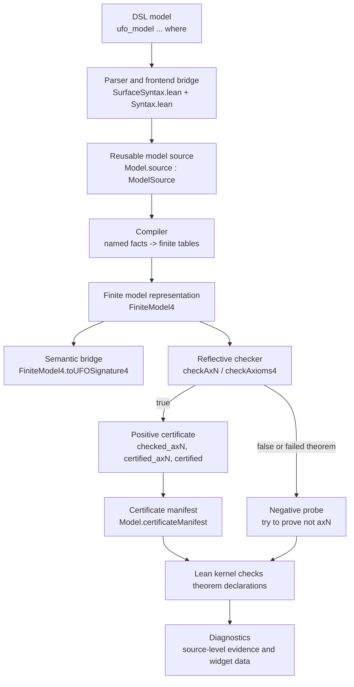
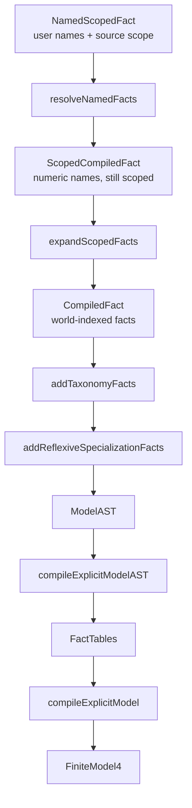
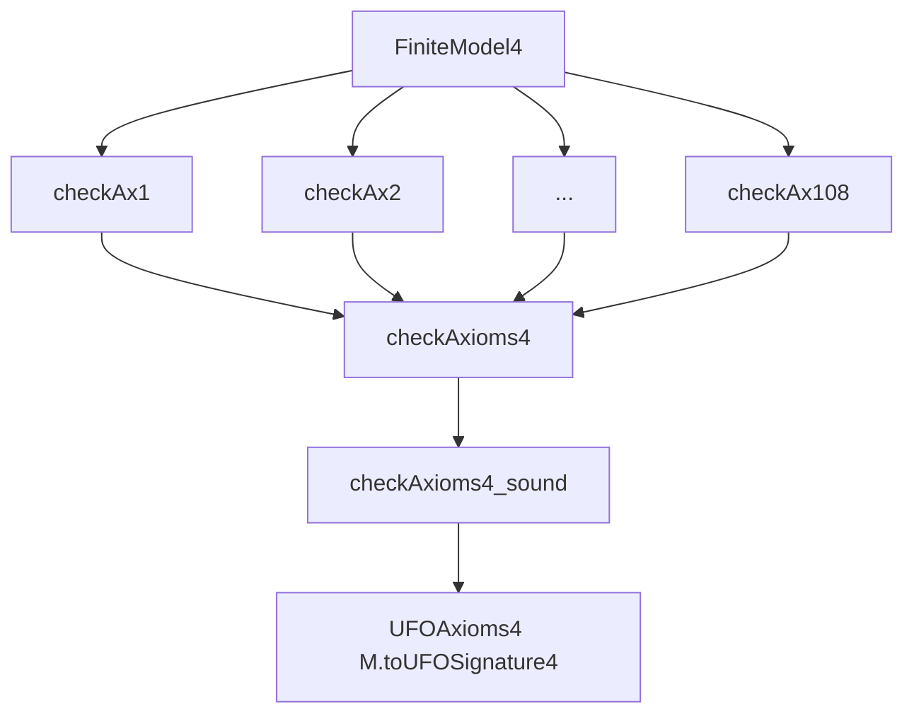
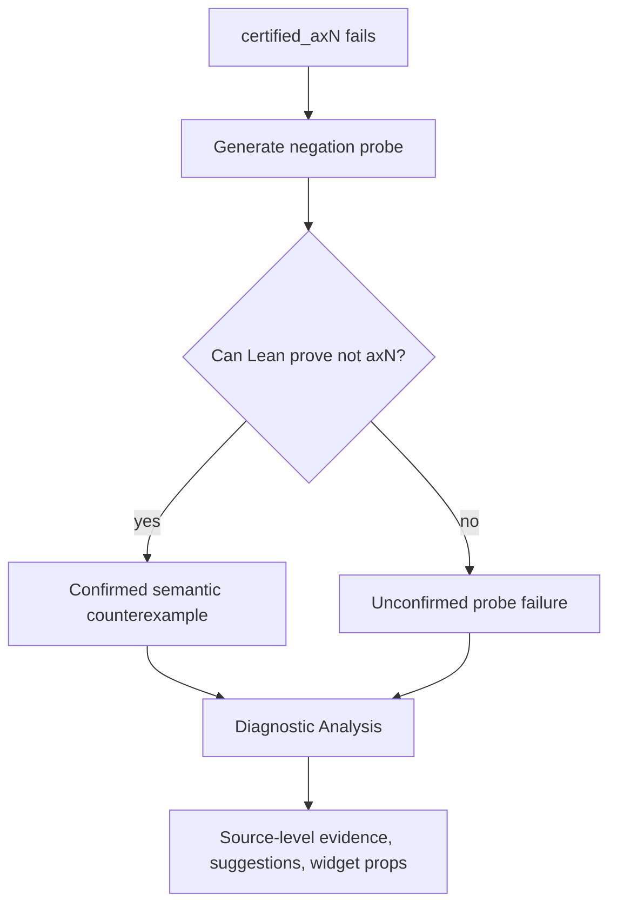

# DSL architecture

[Docs home](../README.md) · [Developer guide](developer-guide.md) · [Project README](../../README.md)

This guide traces a finite UFO model from surface syntax to Lean-checked
certificates and diagnostics. It also records module ownership and the formal
guarantees available at each boundary.

## Directory map and ownership

The source tree is organized by responsibility, not by theorem size:

```text
LeanUfo/UFO/DSL/
  Frontend/          surface grammar and source-text/name translation
  Compiler/          AST, proposition rendering, witness conversion, verified model boundary
  FiniteModel.lean   executable finite representation and semantic bridge
  Checker/           Boolean decisions and their semantic correctness proofs
  Certificate/       proof-term generation, checked-field driver, reuse, and tactics
  Complexity/        operational cost model and compositional bounds
  Diagnostic/        failure analysis and editor presentation
  ConcreteExamples/  user-facing positive and negative models
  Syntax.lean        command elaborator that connects the layers
  Guarantees.lean    small, public cross-layer semantic guarantees
  Examples.lean      aggregate import for the example collection
  Checker.lean       aggregate import for checker users
  Complexity.lean    aggregate import for complexity results
```

An aggregate file contains imports and orientation, not another implementation.
In particular, `Checker.lean` and `Complexity.lean` do not duplicate their
subdirectories. `Certification.lean` supplies decidability for packaged finite
axioms, whereas `Certificate/` emits and reuses concrete theorem declarations;
the similar names describe different stages.

Two checker files preserve registry order. `Checker/Axioms.lean` keeps the
ordered axiom registry beside the checks it registers. `Checker/Soundness.lean`
keeps the matching semantic proofs in the same order.

`Diagnostic/Analysis.lean` integrates two diagnostic paths.
`AxiomAnalysis.lean` owns the private formula language, registered-axiom
analyzers, and their counted reports. `DerivedAssertions.lean` checks named
derived claims before axiom certification and explains their failures. It
imports the shared queries and renderers from the axiom analyzer. The import
direction is one-way. `Analysis.lean` also selects the report after a proof
probe. Its counted selector preserves the confirmed/unconfirmed distinction
and adds probe errors or closure evidence only on the selected branch.

The frontend retains the derived-assertion precheck result while Lean attempts
its semantic proof. If certification stops there, report selection uses the
saved result. It preserves an existing report or constructs the proof-failure
fallback without scanning the facts again.

Within the derived-assertion module, sections follow the execution dependencies:
numeric queries, named dispatch, first-failure selection, report components,
report dispatch, and public producers. Each helper keeps its specification and
cost proofs nearby. These are internal layers of one precheck, not additional
public APIs. The public complexity aggregate imports the resulting guarantees;
it does not keep a second implementation for counting.

`Complexity/Diagnostics/Source.lean` connects the derived-assertion costs to
successful source compilation. It derives the stored-proposition count from
the compiler output and gives a bound in source size. Compiler size lemmas
remain in `Complexity/Compiler.lean`; diagnostic composition imports them.
The frontend's string-to-name conversion lives in `Frontend/ModelText.lean`.
Fresh-model, extension, and imported-source paths share its counted erasure.
The source/diagnostic component bound includes both world and thing arrays.

The intended import direction is:

```text
Frontend vocabulary -> compiler -> finite model -> checker -> certificates
                                      |              |
                                      +-> complexity +-> diagnostics
```

`Syntax.lean` is the integration point and therefore imports several branches.
Lower layers must not import it. This rule keeps the pure compiler and checker
usable without invoking command elaboration.

## High-level ingredients

A `ufo_model` command passes through five layers:

1. user syntax;
2. parsing and name resolution;
3. pure finite-model compilation;
4. reflective Boolean checking;
5. certificate generation and diagnostics.


```mermaid
flowchart TD
  A["DSL model<br/>ufo_model ... where"] --> B["Parser and frontend bridge<br/>SurfaceSyntax.lean + Syntax.lean"]
  B --> S["Reusable model source<br/>Model.source : ModelSource"]
  S --> C["Compiler<br/>named facts -> finite tables"]
  C --> D["Finite model representation<br/>FiniteModel4"]
  D --> E["Semantic bridge<br/>FiniteModel4.toUFOSignature4"]
  D --> F["Reflective checker<br/>checkAxN / checkAxioms4"]

  F -->|true| G["Positive certificate<br/>checked_axN, certified_axN, certified"]
  F -->|false or failed theorem| H["Negative probe<br/>try to prove not axN"]

  G --> M["Certificate manifest<br/>Model.certificateManifest"]
  M --> I["Lean kernel checks theorem declarations"]
  H --> I
  I --> J["Diagnostics<br/>source-level evidence and widget data"]
```

The positive path proves these ordinary Lean declarations (schematically,
with field-specific signature projections omitted):

```lean
Model.checked_axN   : checkAxN Model.data = true
Model.certified_axN : ax_aN Model.sig
Model.certified     : UFOAxioms4 Model.sig
```

The negative path is separate. If certification stops at `axN`, diagnostics try
to prove the negated semantic proposition, shown in the same shorthand:

```lean
¬ ax_aN Model.sig
```

When that negation proof succeeds, the failure is a confirmed semantic
counterexample. When it does not, the diagnostic reports an unconfirmed probe
failure, not a semantic result.

## What is proved where

The pipeline separates trusted metaprogramming from theorem-backed
pure Lean code.

| Stage | Main files | Formal status |
| --- | --- | --- |
| Surface grammar and command elaboration | `Frontend/SurfaceSyntax.lean`, `Syntax.lean` | Trusted frontend/metaprogramming |
| Name and scope compilation | `Compiler.lean`, `Compiler/AST.lean`, `Compiler/Fields.lean` | Pure functions, with pipeline guarantees in `Guarantees.lean` |
| Product-family conversion | `Compiler/ProductFamilies.lean`, `Compiler/VerifiedModel.lean` | Production erases the counted converter; valid source families have exact family/world readback |
| Source-to-model sizes | `Complexity/Compiler.lean` | Cached models have W · F family witnesses, W · S slots, and W + W·T² cache storage. Construction is bounded by source metrics, and checker size by 3N² for source size N |
| Closure cache correspondence | `Compiler/VerifiedModel.lean` | Stored arrays agree with Warshall over the compiled edges. Generated finite models carry that proof, and axiom 68 reads the arrays directly through a counted query |
| Finite-model construction | `Compiler.lean`, `Compiler/VerifiedModel.lean` | Counts witness conversion, fixed-record construction, and proved cache installation. The cached constructor preserves the UFO signature |
| Finite model tables | `FiniteModel.lean` | Ordinary Lean data compiled to a Prop-valued UFO signature |
| Semantic bridge | `FiniteModel4.toUFOSignature4` in `FiniteModel.lean` | Defines the semantic interpretation checked by the core axioms |
| Positive checker | `Checker/Axioms.lean`, `Checker/Soundness.lean` | Soundness proves `checkAxN = true -> ax_aN`; most fields also have completeness |
| Aggregate checker | `Checker/Axioms.lean`, `Checker/Soundness.lean` | `checkAxioms4_sound` proves `checkAxioms4 = true -> UFOAxioms4` |
| Operational costs | `Complexity/CostModel.lean`, `Complexity/Theorems.lean` | Concrete counted execution and fixed/parameterized bounds |
| Checker/table cost correspondence | `Complexity/Queries.lean` | Full value/cost equalities for 112 table-using entries, plus four constant definition checks. All 116 registry entries are covered. Workflow composition uses these source-operation costs, not native instruction counts. |
| Source-linked component bound | `Complexity/Theorems.lean` | Charges successful source compilation, construction of its returned model, and one aggregate checker call. The frontend's repeated per-field checks and report branches require further composition. |
| Source-to-workflow bound | `Complexity/Certification.lean` | Composes compiler output, derived assertions, native proof requests, retries, registry traversal, and selected failure analysis. Provides fixed-registry data complexity and an explicit diagnostic term; excludes Lean proof work and emission. |
| Certificate source generation | `Certificate/Generation.lean` | Trusted code emission, checked afterward by the Lean kernel |
| Axiom diagnostics | `Diagnostic/AxiomAnalysis.lean` | Counted reports; confirmed counterexamples rely on Lean-checked negation proofs |
| Derived-assertion diagnostics | `Diagnostic/DerivedAssertions.lean` | Counted preliminary checks and complete reports before axiom certification; the proved nine-row cap preserves default output |
| Diagnostic integration | `Diagnostic/Analysis.lean`, `Diagnostic/Widget.lean` | Counted probe-report selection and editor presentation |
| Product-family diagnostic validation | `Complexity/Diagnostics/ProductFamily.lean` | Counts checks of supplied witnesses. Successful source compilation proves equal diagnostic/checker registry-search results across witness conversion; costs remain separate |
| Unique-witness search | `Complexity/Diagnostics/Unique.lean` | Proves the sole-match result and linear cost bound of a search that stops at the second match |
| Formula evaluation and failure selection | `Complexity/Diagnostics/Formula.lean` | Explicit cost bounds for the interpreter, minimizer, and successful context, plus bounds on retained arrays. Parameters include formula size, quantifier depth, domains, environments, and atomic-query cost; no uniform polynomial for unrestricted formulas |
| Generic report composition | `Complexity/Diagnostics/Reports.lean` | Formula-size bounds for executed evidence discovery, assignment search, source scans, text, registry selection, and retained output. These compose diagnostic components, not the full source-to-checker pipeline |
| Inherence path evidence | `Complexity/Diagnostics/Paths.lean` | Returned paths follow actual model edges and end at the requested target; reconstruction succeeds exactly for reachable pairs within the existing fuel limit |

Successful certification rests on:

```lean
checkAxioms4_sound :
  checkAxioms4 M = true ->
  UFOAxioms4 M.toUFOSignature4
```

If the generated finite model passes the reflective checker, Lean constructs a
proof that the corresponding semantic signature satisfies the encoded UFO axiom
package.

## Syntax and parser

The user writes a compact named model:

```lean
ufo_model Minimal : UFO where
  worlds actual
  things Person Alice

  given actual:
    ObjectKind(Person)
    Object(Alice)
    Alice :: Person

  derive_relations
  certify
```

The frontend layer is responsible for:

- declaring the grammar accepted by `ufo_model`;
- collecting world names, thing names, facts, and directives;
- translating concrete syntax into internal data;
- emitting `Model.source`, a reusable `ModelSource` value containing the parsed
  model before name resolution;
- emitting Lean declarations and certificate commands.

The relevant files are:

- `Frontend/SurfaceSyntax.lean`: concrete grammar only;
- `Frontend/ModelText.lean`: name-to-field text helpers and fact rendering,
  including counted renderers and their text-equivalence proofs;
- `Certificate/Checking.lean`: `run` owns initial/fresh checked attempts,
  `runField` adds the precheck and semantic attempts, and `runFields` visits
  the registry and retains the successful prefix and reuse records.
  `runAfterAssertions` skips certification after a derived-fact failure;
  `reportAfterRegistry` analyzes only the recorded failed field.
  `Syntax.lean` supplies the elaboration callbacks and erases branch charges.
  `Complexity/Frontend.lean` proves erasure and local driver bounds;
  `Complexity/Certification.lean` supplies source-linked native operands and
  composes the compiler, assertion, registry, and failure-analysis stages;
- `Certificate/Execution.lean`: runs each proof source's native requests under
  its resource options, then inserts the returned proofs into the source;
- `Syntax.lean`: command elaboration, declaration emission, certificate checks,
  and diagnostic storage.

This layer has a narrow role, but it is trusted metaprogramming: Lean checks
the declarations it emits, but the parser/emitter itself is not proved correct
as a compiler.

## Compiler

The compiler is the pure middle of the DSL. Its job is to turn user-facing
named facts into compact finite tables.


```mermaid
flowchart TD
  A["NamedScopedFact<br/>user names + source scope"] --> B["resolveNamedFacts"]
  B --> C["ScopedCompiledFact<br/>numeric names, still scoped"]
  C --> D["expandScopedFacts"]
  D --> E["CompiledFact<br/>world-indexed facts"]
  E --> F["addTaxonomyFacts"]
  F --> G["addReflexiveSpecializationFacts"]
  G --> H["ModelAST"]
  H --> I["compileExplicitModelAST"]
  I --> J["FactTables"]
  J --> K["compileExplicitModel"]
  K --> L["FiniteModel4"]
```

The compiler performs:

- **name resolution**: rejects duplicate names and unknown names;
- **scope expansion**: expands `given everywhere:` into one fact per declared
  world;
- **taxonomy expansion**: adds encoded UFO taxonomy ancestors implied by
  classifications such as `ObjectKind(Person)`;
- **reflexive specialization insertion**: adds facts such as `Person ⊑ Person`
  where the encoded specialization axioms require them;
- **table compilation**: builds Boolean finite tables for unary predicates,
  binary relations, ternary relations, membership, tuple projection, distance,
  and product-family witnesses.

Compiler code is divided among:

- `Compiler.lean`;
- `Compiler/AST.lean`;
- `Compiler/Fields.lean`;
- `Compiler/DerivedFacts.lean`, which renders resolved derived assertions as
  Lean propositions and proves text preservation and construction-cost bounds;
- `Compiler/ProductFamilies.lean`, which converts resolved family records into
  finite witnesses and proves the counted converter's value and cost bounds;
- `Compiler/VerifiedModel.lean`, which supplies the equality proof required to
  select dense native lookup for compiled facts.

Generic compiler guarantees are collected in `Guarantees.lean`. These prove
properties of the pipeline as pure Lean transformations, for example that
expanded facts and generated tables are related in the intended way.

The compiler also exposes `extendModelSource`, used by:

```lean
ufo_model Child : UFO extends Parent : UFO where
  ...
```

The current extension semantics is conservative: a child model may
add things, facts, and product-family witnesses, but it may not add worlds. This
keeps parent `everywhere` facts stable until we explicitly choose an
added-world scoping semantics.

## Finite model representation

`FiniteModel4` is the executable representation checked by the DSL backend. It
stores finite domains and table-valued interpretations:

- `worldCount`;
- `thingCount`;
- unary predicate tables;
- relation tables;
- set-membership and tuple-projection tables;
- product-family witness data used by `ax99`.

The semantic bridge is:

```lean
FiniteModel4.toUFOSignature4 : UFOSignature4
```

The compiler exposes each relation through two internal representations.
Compact sparse definitions keep generated certificate terms small for kernel
reduction. Dense typed arrays provide direct indexed lookup during native
execution. These representations do not perform the same operations.

`ExplicitTableCorrespondence` proves that both representations return equal
values for unary, binary, ternary, and tuple-projection queries on a
well-bounded finite AST. The operational complexity theorem counts dense-array
construction and lookup. It does not count sparse certificate reduction.

This bridge turns finite Boolean tables into the ordinary Prop-valued UFO
signature used by the core formalization. The checker and the generated
certificates are therefore not checking a separate logic: they check that this
finite table interpretation satisfies the same `UFOAxioms4` package used by the
rest of the repository.

## Reflective checker

The reflective checker is an executable Boolean validator for finite models.
For each registered axiom field it provides definitions of the form:

```lean
checkAxN   : FiniteModel4 -> Bool
checkAxNCosted : FiniteModel4 -> Costed Bool
```

The production checker is the `value` projection of the counted checker. Each
counted definition follows Lean's actual short-circuit order and has separate
value-correspondence and operational-bound theorems. The fixed aggregate is an
ordered registry of 116 delayed counted computations.

Projection lookup returns its value and cost together through `TableLookups`.
The proved native replacement performs one dense lookup. Kernel reduction uses
the compact value definition, whose equality to the dense value is proved.
The attached counter measures the dense lookup, not sparse kernel reduction.

Semantic certification follows one explicit computation path:

```text
finite model
  -> explicit Boolean computation (`checkAxN`)
  -> the executor's `nativeEqTrue` call proves the requested Boolean result
  -> reusable soundness theorem turns `true` into the semantic axiom proof
```

This structure separates model failure from proof-search failure. The Boolean
checker decides each finite condition. Lean then applies a reusable soundness
theorem instead of searching a large unfolded proposition for each model.

For an ordinary checker-backed field, the generated semantic proof uses the
stored Boolean theorem. This schematic example abbreviates field-specific
signature projections and prerequisites:

```lean
theorem Model.certified_axN : ax_aN Model.sig :=
  checkAxN_sound Model.data Model.checked_axN
```

The Boolean function `checkAxN` is ordinary Lean code that scans the compiled
finite tables: worlds, things, instantiation, specialization, classifications,
relations, membership, tuple projections, distances, and product-family
witnesses. The reusable theorem `checkAxN_sound` is proved once in
`Checker/Soundness.lean`; each concrete model only has to evaluate the Boolean
checker. `Complexity/Theorems.lean` bounds that computation, and
`Complexity/Certification.lean` composes the scheduled attempts.


```mermaid
flowchart TD
  A["FiniteModel4"] --> B["checkAx1"]
  A --> C["checkAx2"]
  A --> D["..."]
  A --> E["checkAx108"]
  B --> F["checkAxioms4"]
  C --> F
  D --> F
  E --> F
  F --> G["checkAxioms4_sound"]
  G --> H["UFOAxioms4 M.toUFOSignature4"]
```

Checker code is divided among:

- `Checker/Basic.lean`: shared finite scans such as all-world and all-thing
  loops;
- `Checker/Axioms.lean`: executable axiom checkers;
- `Checker/Soundness.lean`: soundness and completeness theorems;
- `Complexity/CostModel.lean`: counted operational semantics;
- `Complexity/Theorems.lean`: compiler, checker, closure, and diagnostic bounds.

The standard per-axiom theorem pattern is:

```lean
checkAxN_sound :
  checkAxN M = true ->
  ax_aN M.toUFOSignature4...
```

For direct negative witnesses and many internal arguments, the checker also
proves:

```lean
checkAxN_complete :
  ax_aN M.toUFOSignature4... ->
  checkAxN M = true

checkAxN_correct :
  checkAxN M = true <-> ax_aN M.toUFOSignature4...
```

`ax99` is the exception. The checker is sound for the core axiom, but
full negative interpretation of `checkAx99 = false` requires explicit product
family witness completeness:

```lean
ProductFamilyWitnessTableComplete M
```

Without that condition, `checkAx99 = false` means that the finite model lacks
stored witness data, not necessarily that the semantic axiom is false.

## Positive certificates

Positive certification is the normal success path. The command emits one theorem
per registered axiom and a final bundled theorem:

```lean
Model.checked_ax1     : checkAx1 Model.data = true
Model.certified_ax1   : ax_a1 Model.sig.toUFOSignature3_1
Model.certified_ax2   : ax_a2 Model.sig.toUFOSignature3_1
-- ...
Model.certified_ax108 : ax_a108 Model.sig

Model.certified : UFOAxioms4 Model.sig
```

The command first emits a Boolean check theorem for each field. For a fresh
proof, the executor evaluates the generated Boolean request through Lean's
`nativeEqTrue` API and inserts the returned proof:

```lean
Model.checked_axN : checkAxN Model.data = true
```

The semantic certificate then uses this stored result through the checker
soundness bridge. It does not normally evaluate the same check again.
Axioms 73, 78, and 79 also need prerequisite results. Their generated proofs
reuse the checked theorems already available in registry order. Axiom 73
still evaluates check 75, and axiom 78 evaluates check 79, because those
fields come later. Axiom 79 needs no further evaluation for its semantic
proof. A trial proof and a final declaration each run their remaining calls.

Counterexample probes reuse preceding fields' checked theorems too. They
evaluate the failed field as false instead of assuming its checked theorem
exists. A failed trial can prevent that declaration from being created.

These `checked_axN` declarations are the reusable certificate atoms. The public
semantic theorem names stay unchanged (`certified_axN`, `certified`,
`certifiedModel`), while the manifest records which check theorem belongs to
which axiom field. Ordinary `certify` may reuse a parent model's check theorem
when either the whole `ModelSource` is unchanged or the registered table
footprint for that axiom is unchanged. `certify_fresh` disables this reuse plan
and forces fresh check theorem generation.

Each certified model also emits:

```lean
Model.certificateManifest : CertificateManifest
```

The manifest is provenance and export metadata, not proof evidence. It records
the model name, Lean version, axiom package, checker name, source and finite
model fingerprints, per-field theorem names, and whether a field was checked
fresh or reused. The Lean theorem declarations remain the authoritative
certificate. The Lean declaration stores compact structural fingerprints and
stable internal IDs; the exporter enriches the JSON manifest with SHA-256
digests of the generated source and finite-table representations.

The footprint-backed reuse registry lives in
`LeanUfo/UFO/DSL/Certificate/Reuse.lean`. It contains one explicit footprint row
for every registered certificate field. A footprint lists the primitive finite
tables read by that field's checker: unary tables, binary tables, ternary
tables, tuple projections, and product-family witnesses. Representative fields:

- `ax13`: unchanged `Endurant` and `Perdurant` footprint;
- `ax61`: unchanged `ConstitutedBy` footprint;
- `ax68`: unchanged `Moment` and `InheresIn` footprint;
- `ax101`: unchanged `Quale` and `Distance` footprint.

The planner first checks fresh mode, then source equality, then the selected
table footprint if the sources differ. Production erases the counted planner.
Array comparisons stop at a length mismatch or the first unequal item; family
comparisons include both slot arrays. `Complexity/Reuse.lean` proves value
equivalence and size bounds under the compiler's abstract string/map interface.
Its source-linked bound uses the actual parent compiler output. The compiler
proofs bound each stored row array by expanded facts and preserve family slots.
The [complexity guide](complexity.md) states the parameters and limits.

The shared checked-attempt driver runs this planner once before the initial
proof trial. Both that trial and its declaration receive the same selected
parent. A failed reuse attempt can trigger fresh proofs, but not another
planner run. The outer axiom-68 precheck can skip this whole driver on failure.
The counted driver includes planning; it does not receive an uncharged parent
selection from outside its cost boundary.

The generator represents registered native decisions as typed requests inside
`CertificateChecking.ProofScript`. Each request supplies its own annotated
proof term, so its field and expected answer also determine the generated goal.
Trial and declaration entry points use the same script in separate attempts.
The executor runs the ordered requests before Lean elaborates the remaining
proof text. A native preparation error stops later requests and is captured
by the frontend's existing failure handling. Resource options apply during
preparation as well as proof elaboration. The loop has erasure and cost proofs,
used by `Complexity/Certification.lean` for the workflow composition. The emitter
and proof-engine work remain outside that algorithmic bound.

Each generated decision compares Boolean results through `resultsAgree`, the
counted comparison's erasure. Expected-answer requests compare the child result
with a literal; agreement requests compare child and parent results.
`Complexity/Frontend.lean` composes their counted operands with this comparison.
It also connects reconstruction to the checker on the returned model. Field
names are resolved by the emitter, not by a new runtime dispatch table. Costs
remain outside generated proof goals to keep kernel reduction compact.

A registry row is a reuse plan, not proof evidence. Once the planner selects a
parent, the generator emits a child `checked_axN` theorem that proves by computation:

```lean
checkAxN Child.data = checkAxN Parent.data
```

Only after Lean checks that equality does the theorem use
`Parent.checked_axN`. If the equality theorem does not elaborate, the generator
falls back to a fresh `checked_axN` proof for the child. The manifest records
the actual result after this fallback, so a field is marked `reused` only when a
Lean-checked reuse theorem was really emitted.

Reuse is a Lean proof, not a trusted cache lookup. The
formal proof pattern is recorded in `Guarantees.lean`:

```lean
CertificateReuse.reused_checker_result_sound
CertificateReuse.reused_checker_semantic_sound
CertificateReuse.reused_aggregate_checker_certified_sound
CertificateReuse.certificateReuseSource_fresh_none
```

These theorems make a reused child check sound only when Lean has
proved equality with the parent check, and that semantic correctness still
comes from the same checker soundness theorem used by fresh certification.

The diagnostics widget receives the same fallback-aware reuse information for
completed fields. It shows a **Certificate reuse** section with reused and
fresh rows; a reused row names the parent `checked_axN` theorem used by the
child proof. If certification later fails, the section still shows the reuse
status for the fields completed before the failure.

The Lean manifest can be rendered as JSON via:

```lean
Model.certificateManifest.toJson
```

The Lake exporter writes these manifests to disk and enriches them with local
git metadata when available:

```bash
lake build LeanUfo.UFO.DSL.ConcreteExamples.ReuseModelExtension
lake exe export-certificates --module LeanUfo.UFO.DSL.ConcreteExamples.ReuseModelExtension --out certificates/
lake exe validate-certificate certificates/CarBase.certificate.json --structure-only
lake exe validate-certificate certificates/CarBase.certificate.json --module LeanUfo.UFO.DSL.ConcreteExamples.ReuseModelExtension
```

If a module contains one or more `export_certificate ModelName` markers, the
exporter writes only those marked models. Otherwise it writes every certified
model it can find in the module source. The JSON value is metadata; the checked
Lean declarations remain the proof artifact. `--structure-only` checks JSON
shape. Default validation requires `--module`, rebuilds the module, checks that
the named Lean declarations have the expected certificate types, and compares
the regenerated SHA-256 digests and theorem names.

The final bundled theorem is assembled from the generated per-axiom proofs. The
Lean kernel checks all declarations, so a successful `certify` command leaves an
ordinary Lean theorem in the environment.

## Negative certificates and diagnostics

Negative certification is not part of the success path. It is a diagnostic
probe used after a model fails.


```mermaid
flowchart TD
  A["certified_axN fails"] --> B["Generate negation probe"]
  B --> C{"Can Lean prove not axN?"}
  C -->|yes| D["Confirmed semantic counterexample"]
  C -->|no| E["Unconfirmed probe failure"]
  D --> F["Diagnostic Analysis"]
  E --> F
  F --> G["Source-level evidence, suggestions, widget props"]
```

A direct negative fixture counts only when Lean proves the negation of the
failed axiom for the generated finite model. This is why diagnostics distinguish:

- **confirmed semantic counterexample**: Lean checked `not axN`;
- **missing witness data**: currently important for `ax99`;
- **timeout-style probe limit**: operational limit in the diagnostic probe;
- **unclassified probe failure**: no semantic conclusion.

`Diagnostic/AxiomAnalysis.lean` reconstructs source-level evidence from the
compiled finite tables. `Diagnostic/DerivedAssertions.lean` reports failed
user-written derived claims before axiom certification. Both are explanatory.
The formal evidence remains the Lean-checked certificate or negation theorem.

## Internal formal guarantees

[Formal guarantees](../guarantees.md) maps these DSL guarantee layers to Lean
theorems:

- compiler and table-pipeline properties in `Guarantees.lean`;
- per-axiom checker soundness in `Checker/Soundness.lean`;
- per-axiom completeness/correctness where available in
  `Checker/Soundness.lean`;
- aggregate checker soundness in `Checker/Soundness.lean`;
- checker erasure, concrete operational bounds, and fixed/parameterized
  registry results in `Complexity/Theorems.lean`;
- finite-model certified packaging in `Certification.lean`.

The most important aggregate theorem is:

```lean
checkAxioms4_sound :
  checkAxioms4 M = true ->
  UFOAxioms4 M.toUFOSignature4
```

This is the theorem that justifies using the Boolean checker as the normal DSL
certification backend. For the detailed list of theorem names and what each
component guarantee means, use the formal-guarantees page.

## Formal complexity result

The [complexity guide](complexity.md) documents the machine model,
literature, exact metrics, and theorem inventory.

The production path is:

```text
checkAxioms4
  = value (checkAxioms4Costed M)
  = value (checkBoundedRegistryCosted (checkAxioms4BoundedRegistry M))
```

The registry has exactly 116 delayed entries. Each entry contains its actual
counted checker, a concrete polynomial bound inferred from that checker's
proof, and the proof itself. The aggregate operational bound is their
heterogeneous sum plus actual short-circuit traversal charges. The erasure
theorem connects this production evaluator to the historical Boolean-list
checker, while `checkAxioms4_sound` separately connects a successful result to
`UFOAxioms4`.

This yields two distinct proved guarantees:

- semantic correctness of a successful finite check;
- operational cost of the concrete compiler/checker computation.

The fixed 116-entry theorem is data complexity. Generic registry theorems make
registry size and per-formula costs explicit for combined complexity.
Diagnostics retain their separate output-sensitive result.
