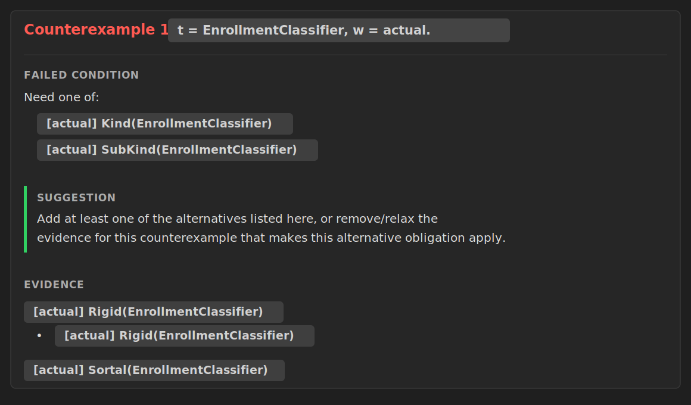
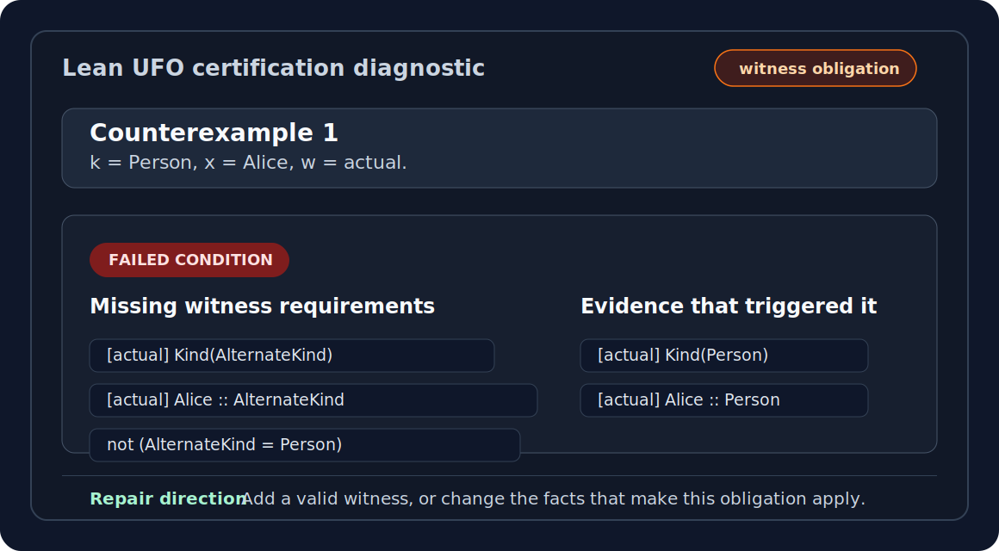

# Diagnostics Guide

[Docs home](../README.md) · [Project README](../../README.md)

The DSL frontend saves a VS Code diagnostics widget for each
`ufo_model ... certify` command. It also emits terminal errors for failed
commands.

## What The Widget Shows

- model name;
- declared worlds and things with generated finite indices;
- user-written input facts;
- expanded finite facts after taxonomy and scope expansion;
- certificate status for each registered axiom;
- failure analysis for derived assertion failures and certificate failures.

Certificate fields are reported as:

- `success`: this generated theorem checked;
- `failed`: this is the first field that did not certify;
- `unchecked`: certification stopped before this field.

## Counterexample Confirmation

When a generated certificate fails, the frontend runs a separate negative probe.

If Lean proves the negation of the axiom for the generated finite model, the
diagnostic marks the failed axiom as a confirmed finite counterexample. This is
the semantic-failure case: Lean has checked a proof of `¬ axN` for the generated
finite signature.

If the negation probe also fails, the diagnostic says that no counterexample
proof was found. That branch is not a semantic counterexample. It is classified
as either a heartbeat/timeout-style counterexample-probe limit when Lean reports
one, or as an unclassified probe failure when no timeout marker is recognized.

So the reliable reading is:

- confirmed counterexample: kernel-checked proof of the axiom's negation;
- timeout-style probe failure: operational probe limit, not model
  evidence;
- unclassified probe failure: implementation issue to investigate, not model
  evidence.

## Paired Example

The following model makes `EnrollmentClassifier` a rigid sortal object type but
does not classify it as a `Kind` or `SubKind`:

```lean
ufo_model FailedEnrollmentClassifier : UFO where
  worlds actual
  things PersonKind EnrollmentClassifier Alice
  given actual:
    ObjectKind(PersonKind)
    ObjectType(EnrollmentClassifier)
    Rigid(EnrollmentClassifier)
    Sortal(EnrollmentClassifier)
    EnrollmentClassifier ⊑ PersonKind
    Object(Alice)
    Alice :: EnrollmentClassifier
    Alice :: PersonKind
  derive_relations
  certify
```

Certification stops at `ax26` and presents the counterexample as follows:



## Condition Headings

Counterexample boxes use headings that describe the shape of the failed
obligation:

- `Required but missing`: one missing DSL-level fact is required.
- `Need one of`: at least one listed alternative must hold.
- `Required together`: all listed facts/conditions must hold together.
- `Missing witness requirements`: an existential/witness obligation is missing.
- `Forbidden condition`: a fact or combination holds but should be absent.

The card above shows a `Need one of` obligation: at least one listed
alternative is missing.

For a witness obligation, the same information is presented as a diagnostic card:



The user needs a witness satisfying all listed requirements.

## Suggestions And Evidence

Suggestions use layout-neutral wording such as "this counterexample", so the
same text works in the VS Code widget and terminal output.

Evidence lines show the finite DSL facts that made the obligation apply.

## Checker-Aware Counterexamples

Most checker-backed axioms with direct completeness theorems now use a
checker-aware negative probe.  The probe proves `¬ axN` by contradiction: if
the semantic axiom proposition held, `checkAxN_complete` would force the
Boolean checker to return `true`; for the failing finite model,
`native_decide` computes `checkAxN data = false`.

`ax68` is the hardest covered example. It is checker-backed by the same bounded
finite closure idea used by the diagnostic explanation: a moment must reach a
unique non-moment ultimate bearer through the finite `InheresIn` closure. The
positive certificate path is proved against the inductive `MomentOf` semantics,
and the negative path uses `checkAx68_complete`.

For users, the diagnostic text already reports the finite closure reason:

- no reachable non-moment ultimate bearer exists for a moment; or
- more than one reachable non-moment ultimate bearer exists.

This means direct negative fixtures for checker fields can count as managed
semantic counterexamples when the checker reports failure. The
prerequisite-dependent §3.10 fields `ax73`, `ax78`, and `ax79` use the same
pattern with explicit prerequisite checks before applying their
prerequisite-aware completeness theorems.

`ax99` is handled more carefully. The axiom requires a finite product-family
witness for each active quality-domain association, and the reflective checker
can only inspect witnesses written in the model with `product_family`. If that
data is missing, diagnostics do not call the result a confirmed semantic
counterexample. They report that the finite witness table is incomplete and
name the missing domain/type pair, for example:

```text
Missing product-family witness data for x = ColorDomain, t = ColorQuality, w = actual.
```

The message then lists the ordinary facts needed to make the witness checkable:
the `product_family` block, component `Characterization` facts,
`AssociatedWith` facts for the dimensions, domain `MemberOf` facts,
`TupleProjection` facts, and coordinate `MemberOf` facts.

[Docs home](../README.md) · [Project README](../../README.md)
